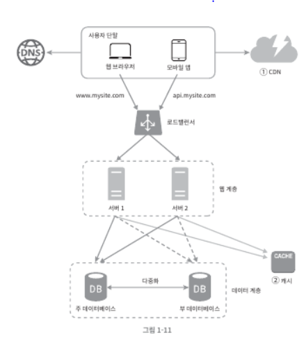

# 1 사용자 수에 따른 규모 확장성
- 수백만 사용자를 지원하는 시스템을 설계하는건 도전적인 과제
- 지속적인 계량과 끝없는 개선이 요구되는 여정

## 1.1 단일 서버
- 웹 앱, 데이터 베이스, 캐시 등 전부 서버 한 대에서 실행\

  - ① 도메인을 DNS에게 질의하여 IP 주소로 변환
  - ② DNS 조회 결과로 IP 주소 반환
  - ③ 해당 IP 주소로 HTTP 요청 
  - ④ HTTP 요청에 대한 결과 수신
    - 웹 애플리케이션: HTML
    - 모바일 앱: Json

## 1.2 데이터베이스
- 사용자가 늘면 하나 서버 하나로 충분하지 않아서 여러 서버 사용
- 하나는 웹/모바일 트래픽 처러 서버(웹 계층), 하나는 데이터 베이스 서버(데이터 계층)\

- 어떤 데이터 베이스를 사용할 것인가?
  - 관계형 데이터베이스(RDB)
    - MySQL, ORACLE 등 존재
    - 테이블, 열, 칼람으로 표현
    - 관계에 따른 테이블간 조인(Join)
  - 비 관계형 데이터베이스(NoSQL)
    - Cassandra, Hbase 등
    - 네가지 분류로 나눌 수 있음
      - 키-값 저장소
      - 그래프 저장소
      - 칼럼 저장소
      - 문서 저장소
    - 일반적으로 조인 연산은 지원하지 않음
  - 아래와 같은 경우 NoSQL이 RDB 보다 더 좋을 수 있음
    - 아주 낮은 응답 지연시간 요구
    - 다루는 데이터가 비정형이라 관계형 데이터가 아님
    - 데이터를 직렬화 또는 역직렬화 할 수 있기만 하면 됨
    - 아주 많은 양의 데이터를 저장할 필요가 있음

## 1.3 수직적 규모 확장 VS 수평적 규모 확장
- 수직적 규모 확장(Scale up)
  - 서버 리소스(더 좋은 CPU, RAM 용량 추가)를 추가하는 행위
- 수평적 규모 확장(vertical scaling or scale out)
  - 서버를 추가하여 성능을 개선하는 해위
- 서버로 유입되는 트래픽 양이 적을 때는 수직적 확장이 좋은 방법
  - 장점
    - 간편하게 성능 개선
  - 단점
    - CPU나 메모리를 무한대로 증설할 방법은 없음
    - 자동복구(failover)방안이나 다중화 방안을 제시하지 않음
- 위와 같은 단점 때문에 대규모 애플리케이션에서는 수평적 확장이 보다 적절

#### 로드밸런서

  - 부하 분산 집합에 속한 웹 서버들에게 트래픽 부하를 고르게 분산
  - 사용자는 로드밸런서의 공개 IP 주소로 접근
  - 로드밸런서와 서버 사이의 통신에는 사설 IP 이용
  - 자동 복구(failover) 문제 해소와 웹 계층의 가용성 향상
    - 서버 1이 다운 되면 서버 2로 트래픽이 전송
    - 2개의 서버가 감당하기 힘든 트래픽이 증가하면? 서버 추가
    
#### 데이터베이스 다중화

- 많은 DBMS에서 다중화를 지원함
- 보통 master(데이터 원본)-slave(데이터 사본) 관계 설정
- 쓰기연산(CUD) 관련해서는 master, 읽기(R) 연산은 slave에서 지원
  - 일반적인 애플리케이션은 읽기 연산 비중 > 쓰기 연산 비중
- 데이터베이스 다중화 장점
  - 더 나은 성능: 쓰기와 일기 연산 분산에 따른 병렬처리 가능
  - 안전성: DR 보장
  - 가용성: 하나의 서버가 장애가 발생하더라도 HA 보장
- 데이터베이스 가용성 확장
  - 부서버 한대뿐인데 다운되면? 읽기 연산을 주서가 한시적으로 처리하며 추후 다른 부서버로 대체
  - 주 서버가 다운 되면? 한 대의 부서버가 새로운 주 서버가 됨
    - 프로덕 상황에서는 더 복잡 -> 데이터 동기화에 대해 이슈, 없는 데이터에 대해 복구 스크립트 추가 필요
    - 다중 마스터나 원형 다중화 방식이 더 도움됨

- 현재 상태에서 응답시간 개선 방향 캐시와 CDN을 통해 개선\

## 1.4 캐시
- 값 비싼 연산 결과 또는 자주 참조되는 데이터를 메모리 안에 저장 후 제공
- 애플리케이션 성능은 데이터베이스를 얼마나 자주 호출하느냐에 크게 좌우되는데, 캐시는 그런 문제 완화

#### 캐시 계층
- 데이터가 잠시 보관되는 곳으로 데이터베이스보다 훨씬 빠름
- 별도 캐시 계층을 두면 성능이 개선될 뿐 아니라 데이터베이스의 부하를 줄일 수 있음\

- 읽기 주도형 캐시 전략(read-through caching strategy)
  - 캐시에 응답 데이터 존재 하면 캐시에서 제공
  - 없다면 데이터 베이스를 통해 가공한 데이터를 캐시 저장 후 제공
- 캐시 사용 시 유의사항
  - 캐시는 어떤 상황에 바람직한가?
    - 데이터 갱신이 자주 일어나지 않지만 참조는 비번할 때 고려
  - 어떤 데이터를 캐시에 두어야 하는가?
    - 휘발성이 있기에 영속적으로 보관할 데이터를 캐시에 두는 것은 바람직 하지 않음
    - 중요한 데이터는 지속적 저장소에 두어야함
  - 캐시에 보관된 데이터는 어떻게 만료되는가?
    - 만료된 데이터는 삭제 되어야함 -> 만료 정책이 없으면 캐시가 계속 남음
    - 만료 기한이 너무 짧으면? 데이터베이스를 너무 자주 읽게 됨
    - 만료 기한이 너무 길면? 원본과 차이가 날 가능성이 높아짐
  - 일관성(원본과 사본 일치성)은 어떻게 유지되는가?
    - 저장소의 원본을 갱신하는 연산과 캐시를 갱신하는 연산이 단일 트랜잭션으로 처리되지 않으면 일관성이 깨질 수 있음
    - 여러 지역에 걸쳐 시스템을 확장해 나가는 경우, 캐시와 저장소 사이의 일관성을 유지하는 것은 어려운 문제
      (?) 이럴 땐 어떤 방법이 좋을까? 나라면 메시지 큐를 통해 관련 토픽에 대한 이벤트 생성해 줘서 처리해줄 꺼 같음
  - 장애에는 어떻게 대처할 것인가?
    - 캐시 서버를 한 대만 두는 경우 해당 서버는 단일 장애 지점이 되어 버릴 가능성이 있음
    - 위와 같은 장애 상황을 피하기 위해 분산 시켜야함
  - 캐시 메모리는 얼마나 크게 잡을 것인가?
    - 메모리가 너무 작으면 데이터가 너무 자주 캐시에서 밀려나버려(eviction) 성능 떨어짐
    - 캐시 메모리를 과할당(overprovision)하면 데이터가 갑자기 늘어났을 때 장애 방지
      (?) 리소스가 거의 무한하다는 과정 아닌가? 다른 곳에서는 캐시 메모리 할당에 대한 정책이 따로 있는지?
  - 데이터 방출(eviction) 정책은 무엇인가?
    - 캐시가 꽉 차버리면 추가로 캐시에 데이터를 넣어야 할 경우 기존 데이터를 내보냄
    - 일반적으로 LRU(Least Recently used), LFU(Least Frequently used) 나 FIFO 활용
    - 경우에 맞게 적용

## 1.5 콘텐츠 전송 네트워크(CDN)
- 정적 콘텐츠를 전송하는데 쓰이는 분산된 서버의 네트워크
  - 동적 콘텐츠 캐싱은 새로운 개념이기에 이 책에서는 안다룸
- 요청 경로, 질의 문자열, 쿠키, 요청 헤더 등의 정보에 기반하여 HTML 페이지를 캐시하는 것
- CDN 동작 과정\

  - 사용자 웹사이트 방문 -> 사용자에게 가장 가까운 CDN 서버가 정적 콘텐츠 전달
  - CDN 서버에 이미지에 대한 캐시가 없으면 원본 서버에 요청하여 파일 가져옴
  - 원본 서버가 파일을 CDN에 반환, HTTP 헤더에 TTL(Time-To-Live) 값이 들어 있음
  - CDN 서버는 파일을 캐시하고 사용자에게 반환, TTL에 명시된 시간이 끝날 때가지 캐시
- CDN 사용 시 고려해야할 사항
  - 비용
    - CDN은 보통 제3 사업자에 의해 운영
    - CDN 데이터 전송 양에 따라 요금 부과 되기에 자주 사용되지 않는 콘텐츠는 CDN에서 빼는 것 고려
  - 적절한 만료 시한 설정
    - 시의성이 중요한(time-sensitive) 콘텐츠의 경우 만료시점 중요
    - 너무 길면 콘텐츠의 신선도가 떨어지고, 짧으면 원본 서버에 비번히 접속
  - CDN 장애에 대한 대처 방안
    - CDN 자체가 죽었을 경우 웹사이트/애플리케이션 어떻게 동작해야 하는지 고려
    - 일시적으로 CDN이 응답하지 않은 경우? 문제 감지 및 원본 서버로 부터 직접 콘텐츠 가져오도록 클라이언트를 구성
      (?) 클라이언트가 포인트, 서버에서 대처가 아닌
  - 콘텐츠 무효화 방법
    - CDN 서비스 사업자가 제공하는 API를 이용하여 콘텐츠 무효화
    - 콘텐츠의 다른 버전을 서비스하도록 오브젝트 버저닝 이용
      - image.png?v=2 이런식
      (?) 프론트쪽 보면 css나 javascript에 이런게 있던데, 배포팩 만들때 자동으로 해주는거?
- 아래는 다음과 같은 효과가 있음
  - 정적 콘텐츠는 CDN을 통해 더 빠른 호출 성능 보장
  - 캐시를 통한 데이터베이스 부화 감소
\

