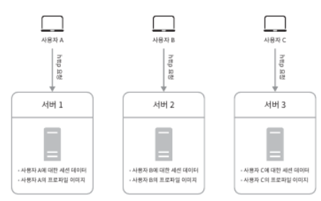
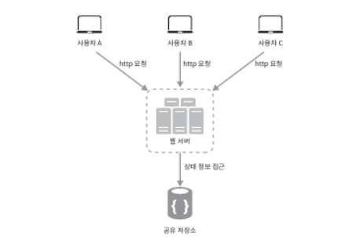
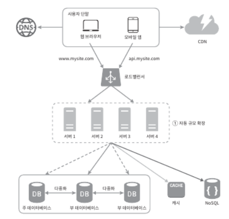

## 1.6 무상태(stateless) 웹 계층
- 상태 정보를 웹 계층에서 제거해야 함 -> 웹 계층 수평적 확장을 하기 위해
- 상태 정보를 RDB나 NoSQL 같은 지속성 저장소에 보관 -> 무상태 웹 계층

#### 상태 정보 의존적인 아키텍처

- 상태 정보를 보관하게 되면? 관련된 요청은 특정 서버로 전송되어야 함
  - sticky 방식으로 이는 로드밸러서에게 부담
  - 로드밸런서 뒷단 서버를 추가 또는 제거가 까다로워짐

#### 무상태 아키텍처

- 어떤 웹 서버로도 HTTP 요청을 받을 수 있음
- 상태 정보는 웹 서버로부터 물리적으로 분리
  - 단순하고 안정적이며, 규모 확장이 쉬움
- 세션 데이터를 웹 계층에서 분리하고 지속성 데이터 보관소 저장\

- 저장소로 RDB, Mecached/redis 같은 캐시 일수도, 또는 NoSQL일수도 있음
  - 그림에선 NoSQL을 활용하였는데, 규모 확장 편이 때문임

