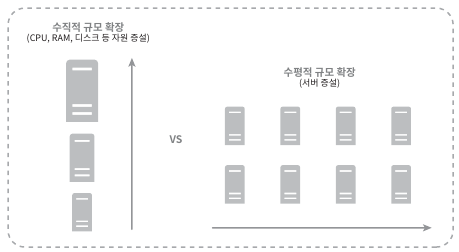

## 1.6 무상태(stateless) 웹 계층
- 상태 정보를 웹 계층에서 제거해야 함 -> 웹 계층 수평적 확장을 하기 위해
- 상태 정보를 RDB나 NoSQL 같은 지속성 저장소에 보관 -> 무상태 웹 계층

#### 상태 정보 의존적인 아키텍처

- 상태 정보를 보관하게 되면? 관련된 요청은 특정 서버로 전송되어야 함
  - sticky 방식으로 이는 로드밸러서에게 부담
  - 로드밸런서 뒷단 서버를 추가 또는 제거가 까다로워짐

#### 무상태 아키텍처

- 어떤 웹 서버로도 HTTP 요청을 받을 수 있음
- 상태 정보는 웹 서버로부터 물리적으로 분리
  - 단순하고 안정적이며, 규모 확장이 쉬움
- 세션 데이터를 웹 계층에서 분리하고 지속성 데이터 보관소 저장\

- 저장소로 RDB, Mecached/redis 같은 캐시 일수도, 또는 NoSQL일수도 있음
  - 그림에선 NoSQL을 활용하였는데, 규모 확장 편이 때문임

## 1.7 데이터 센터
- 지리적 라우팅: 장애가 없는 상황에서 가장 가까운 데이터 센터로 안내
- GeoDNS: 사용자의 위치에 따라 도메인 이름을 어떤 IP 주소로 변환할지 결정해주는 DNS 서비스\

- 장애 발생시 아래와 같이 작동함\

- 다중 데이터센터 아키텍처를 만들려면 몇 가지 기술적 난제 해결 필요
  - 트래픽 우회
    - 올바른 데이터 센터로 트래픽을 보내는 효과적인 방법을 찾아야함
    - GeoDNS는 가장 가까운 데이터센터로 트래픽을 보낼 수 있도록 해줌
  - 데이터 동기화
    - 데이터 센터마다 별도의 데이터베이스를 사용하고 있으면 데이터 동기화 필요
    - 보편적 전략은 데이터를 여러 데이터센터에 걸쳐 다중화 -> 넷플릭스에서 활용
  - 테스트와 배포
    - 여러 데이터 센터를 사용하도록 시스템이 구성된 상황이면 여러 위치에서 테스트 해보는 것이 중요
    - 자동화된 배포 도구를 통해 동일한 서비스가 설치되도록 구성
    
(?)GeoDNS면 로드 밸런서 쪽이 아닌 DNS 그림이 그려져 있어야하지 않나? 지리적 가장 가까운 곳으로 라우팅인데?

## 1.8 메시지 큐
- 메시지의 무손실을 보장하는 비동기 통신을 지원하는 컴포넌트
- 메시지의 버퍼 역할을 하며, 비동기적으로 전송
- 서비스 또는 서버 간 결합이 느슨해져서, 규모 확장성이 보장\

## 1.9 로그,메트릭 그리고 자동화
- 사업 규모가 커지면 로그, 메트릭 및 자동화는 필수
  - 로그
    - 에러 로그를 모니터링하는 것은 중요 -> 시스템의 오류와 문제들을 보다 쉽게 찾아낼 수 있음
  - 메트릭
    - 사업 현화에 관한 유용한 정보를 얻을 수 도 있고, 시스템의 현재 상태를 손쉽게 파악
    - 호스트 단위 메트릭: CPU, 메모리, 디스크 I/O
    - 종합 메트릭: 데이터베이스 계층의 성능, 캐시 계층의 성능
    - 핵심 비즈니스 메트릭: 일별 능동 사용자, 수익
  - 자동화
    - 시스템이 크고 복잡해지면 생산성을 위해 자동화 도구를 활용
    - CI 도구를 활용하면 개발자가 만드는 코드 검증 절차에 활용 용이

#### 메시지 큐, 로그, 메트릭, 자동화 등을 반영하여 수정한 설계안
- 메시지큐는 컴포넌트가 느슨한 결합 제공, 결함에 대한 내성을 높힘\

## 1.10 데이터베이스의 규모 확장

- 저장할 데이터가 많아지면 데이터베이스에 대한 부하도 증가 -> 증설 방법 필요
- 수직적 규모 확장 또는 수평적 규모 확장 방법 존재
  - 수직적 확장(scale up)
    - 고성능의 자원(CPU, RAM) 증설
    - 심각한 몇가지 약점 존재
      - 하드웨어에는 한계 존재 -> CPU, RAM 등 무한 증설 힘듬
      - SPOF(Single Point of Failure)로 인한 위험성
      - 비용 증가
  - 수평적 확장(Sharding)
    - 더 많은 서버를 추가함으로써 성능을 향상시킬 수 있도록 함
    - 대규모 데이터베이스를 샤드라고 부르는 작은 단위로 분할하는 기술이며, 데이터 중복이 없음\
    
    - 샤딩 전략을 구현할 때 고려해야 할 가장 중요한 것은 샤딩 키를 어떻게 정하느냐 하는 것
      - 위 그림에서는 user_id가 샤딩 키
    - 샤딩을 도입하려면 새로운 문제 발생
      - 데이터의 재 샤딩
        - 데이터가 너무 많아져 하나의 샤드로 감당이 어려울 때
        - 샤드 간 데이터 분포가 균등하지 못하여 어떤 샤드에 할단된 공간 소모가 빨리 진행될 때\
        -> 샤드 키 계산하는 함수 변경 후 데이터 재 배치
        - 안정 해시 기법으로 문제 해결
      - 유명인사 문제(핫스팟 키 문제)
        - 특정 샤드에 질의가 집중되어 서버에 과부하가 걸리는 문제
        - 참조가 많은 데이터에 대해 각 샤드 하나씩 할당 되어야 하며, 심지어 더 잘게 쪼개야할 수도 있음
      - 조인과 비정규화
        - 여러 샤드에 걸친 데이터 조인하기 힘들어짐 -> 데이터베이스를 비정규화하여 하나의 테이블에서 질의가 수행될 수 있도록 하는 것\
          (?)데이터 복제를 말하는걸까? 음...
- 하기 그림은 규모 확장을 적용해 본 것\

(?) 샤딩은 주 서버 확장에 관한거이면서, 레플리카는 다른 복제에 대한것으로 이해 하였는데 맞는건지? -> SPOF에 대해 헷갈림
## 1.11 백만 사용자, 그리고 그 이상
- 시스템의 규모 확장은 지속적이고 반복적인 과정
- 수백만 사용자 이상을 지원하려면 새로운 전략을 도입하고 지속적으로 시스템을 가다듬어야 할 것
  - 웹 계층을 무상태 계층으로
  - 모든 계층에 다중화 도입
  - 가능한 한 많은 데이터를 캐시할 것
  - 여러 데이터 센터를 지원할 것
  - 정적 콘텐츠는 CDN을 통해 서비스할 것
  - 데이터 계층은 샤딩을 통해 그 규모를 확장할 것
  - 각 계층은 독립적 서비스로 분할할 것
  - 시스템을 지속적으로 모니터링하고, 자동화 도구들을 활용할 것