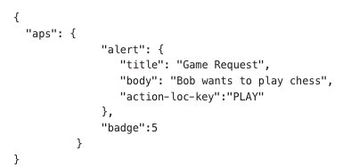
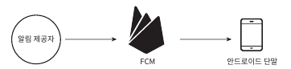

# 10. 알림 시스템 설계
- 중요할 만한 정보를 비동기적으로 제공
- 모바일 푸시 뿐만 아니라 SMS와 이메일 포함

## 10.1 문제 이해 및 설계 범위 확정
- 하루에 백만 건 이상의 알림을 처리하는 확장성 높은 시스템 구축은 어려운 작업임
- 조건은 아래와 같음
    - 푸시 알림, SMS 메시지, Email 지원
    - 연성 실시간(soft real-time) 시스템
    - IOS,Android, 랩톱/데스크톱 지원
    - 클라이언트 또는 서버측 스케쥴링을 통한 발송 
    - 알림 받지 않는 설정 지원
    - 데일리 천만건 모바일 푸시, 백만건 SMS, 5백만 건의 이메일 발송 가능

## 10.2 개략적 설계안 제시 및 동의 구하기
- 아래와 같은 사항을 개략적으로 살펴볼 것
  - 알림 유형별 지원 방안
  - 연락처 정보 수집 절차
  - 알림 전송 및 수신 절차

##### 알림 유형별 지원 방안
- IOS 푸시 알림\

  - 알림 제공자: 알림 요청 생성자
    - 단말 토큰: 알림 요청을 보내는 필요한 고유 식별자
    - 페이로드: 알림 내용 담은 JSON 딕셔너리\

  - APNS: IOS 애플 푸시 서비스
  - IOS 단말: 푸시 알림 수신용 단말
- 안드로이드 푸시 알림\

  - APNS 대신 FCM 활용
- SMS 메시지\

  - 트윌리오, 넥스모와 같은 제3 사업자 서비스
- 이메일\

  - 자체 메일 서버 or 사용 이메일 서비스(센드그리드, 메일 침프 등)
- 아래는 하나의 시스템으로 묶은 결과\

##### 연락처 정보 수집 절차
- 알림을 보내려면 모바일 단말 토큰, 전화 번호, 이메일 주소 등의 정보 필요\

- 앱 설치하거나 처음 계정 등록 시, 사용자 정보 수집 및 DB 저장\

##### 알림 전송 및 수신 절차
- 개략적 설계안에서 점차 최적화 하기로 함
- 개략적 설계안(초안)\

  - 아래와 같은 구성
    - 1~N까지의 서비스: 푸시 요청 보내려는 서비스
    - 알림 시스템: 제 3자 서비스에 알림 요청하는 시스템
    - 제 3자 서비스: 실제 단말로 알림 전달하는 서비스
    - 단말: 알림 수신 기기
  - 몇가지 문제점 존재
    - SPOF: 서버 한대의 문제
    - 규모 확장성: 한 대 서비스로 모든 것을 처리하면, 데이터베이스나 캐시 등 개별적 확장 어려움
    - 성능 병목: HTML 페이저 생성 등 리소스 많이 드는 작업이면, 트래픽 몰릴 시 과부하 예상
- 개략적 설계안(개선된 버전)\

  - 아래 구성
    - 알림서버
      - 알림 전송 API: 스팸 방지를 위한 사내 서비스 및 인증된 클라이언트만 허용
      - 알림 검증: 이메일 주소, 전화번호 등에 대한 기본적인 검증
      - 데이터베이스 및 캐시 질의: 알림에 포함시킬 데이터 가져오기
      - 알림 전송: 알림 데이터를 큐에 삽입
      - 캐시: 사용자 정보, 단말 정보 등을 캐시
      - 데이터 베이스: 사용자, 알림, 설정 등 다양한 정보 저장
      - 메시지 큐: 컴포넌트 간 의존성 제거 및 버퍼 역할
      - 작업 서버: 제3자 서비스로 알림 전송

## 10.3 상세 설계
- 아래와 같은 사항들 더 자세히 검토
  - 안정성
  - 추가로 필요한 컴포넌트 및 고려사항: 알림 템플릿, 전송률 제한, 재시도 매커니즘 등
  - 개선된 설계안

##### 안전성
- 데이터 손실 방지\

  - 지연이나 순서는 틀려도 알림 손실되면 안됨
  - 알림 데이터를 DB 보관하고 재시도 매커니즘 구현 필요
- 알림 중복 전송 방지
  - 분산 환경에서 같은 알림 중복 발송을 완전히 막는건 불가
  - 중복을 최대한 줄이려면 중복 탐지 메커니즘 필요
    - 보내야 할 알림이 도착하면 이벤트 ID를 검사하여 이전에 본 적이 있는 이벤트인지 확인
    - 
##### 추가로 필요한 컴포넌트 및 고려사항
- 알림 템플릿
  - 알림 메시지는 대부분 유사하기에, 매 요청마다 처음부터 만들 필요가 없음
  - 템플릿을 활용하여 형식 일관성 유지 및 알림 작성 시간 단축
- 알림 설정
  - 너무 많은 알림을 받으면 사용자는 피곤을 느낌
  - 테이블을 통해 알림 설정 기능 활용
- 전송률 제한
  - 사용자에게 너무 많은 알림을 보내지 않도록 알림 빈도 제한
- 재시도 방법
  - 해당 알림을 재시도 전용큐에 넣어 재시도
  - 같은 문제가 지속적으로 발생하면 개발자에게 통지
- 푸시 알림과 보안
  - 모바일 푸시 알림과 같은 경우 appkey와 appSecret 활용하여 보안 유지
- 큐 모니터링
  - 알림 시스템 내 큐는 매우 중요
  - 큐에 쌓인 알림 개수를 모니터링 필요
- 이벤트 추적
  - 알림 확인율, 클릭율, 실제 앱사용으로 이어지는 비율 등의 메트릭 필요 -> 사용자 이해

##### 개선된 설계안

## 10.4 마무리
- 해당 프로젝트는 아래 주제에 집중
  - 안전성: 메시지 전송률 실패 낮추기 -> 재시도 메커니즘 도입
  - 보안: 인증된 클라이언트만 알림 발송 가능 -> appKey 및 appSecret 활용
  - 이벤트 추적 및 모니터링: 알림 생성에서 전송까지 모니터링 필요
  - 사용자 설정: 사용자 알림 수신 설정 조정 기능 제공
  - 전송률 제한: 사용자에게 알림 보내는 빈도 제한