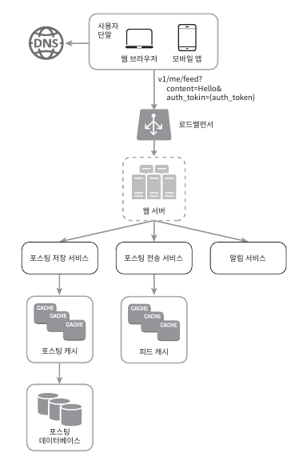
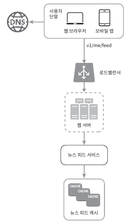
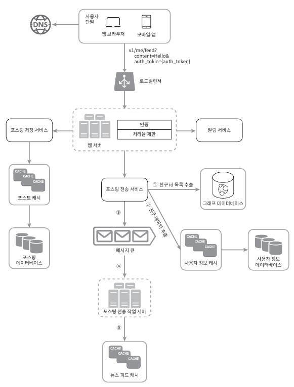
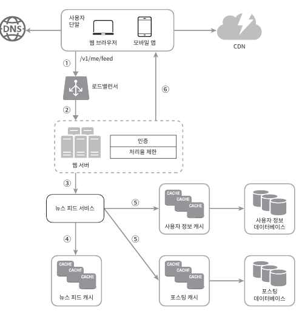
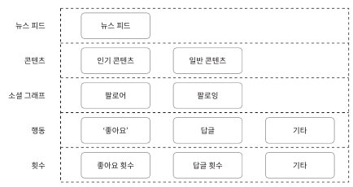

# 11. 뉴스 피드 시스템 설계
- "페이스북 뉴스 피드 설계", "인스타그램 피드 설계" 등으로 출제됨

## 11.1 문제 이해 및 설계 범위 확정
- 조건은 아래와 같음
  - 모바일 앱 및 웹에서 지원
  - 뉴스 피드 페이지에 새로운 스토리 업로드 및 친구들 스토리 확인 가능
  - 시간 흐름 역순 정렬
  - 한명 당 5,000명 친구 맺기 가능
  - 매일 천만 명 방문 가능
  - 스토리에 이미지나 비디오 등의 미디어 파일 포함 가능

## 11.2 개략적 설계안 제시 및 동의 구하기
- 아래와 같이 두 가지 파트로 나뉨
  - 피드 발행
    - 사용자가 스토리를 포스팅하면 해당 데이터를 캐시와 데이터베이스에 기록
    - 새 포스팅은 친구의 뉴스 피드에도 전송
  - 뉴스 피드 생성
    - 노든 친구의 포스팅을 시간 흐름 역순으로 모아서 생성

##### 뉴스 피드 API
- 뉴스 피드 API는 클라이언트가 서버와 통신하기 위해 사용하는 수단
- HTTP 프로토콜 기반이며, 상태 정보 업데이트 또는 친구 추가 등의 다양한 작업 수행
- 피드 발생 API
  - 새 스토리를 포스팅하기 위한 API
  - POST /v1/me/feed
  - 인자
    - body: 포스팅 내용
    - Authorization 헤더: API 호출을 위한 인증에 활용
- 피드 읽기 API
  - 뉴스 피드 가져오는 API
  - GET /v1/me/feed
  - 인자
    - Authorization 헤더: API 호출을 위한 인증에 활용

##### 피드 발행

- 사용자: 새 포스팅을 올리는 주체
- 로드밸런서: 트래픽을 분산
- 웹 서버: HTTP 요청을 내부 서비스로 중계하는 역할
- 포스팅 저장 서비스: 새 포스팅을 데이터베이스와 캐시에 저장
- 포스팅 전송 서비스: 새 포스팅을 친구의 뉴스 피드에 푸시
- 알림 서비스: 새 포스팅이 올라왔음을 알리거나 푸시 알림을 보내는 역할

##### 뉴스 피드 생성

- 사용자: 뉴스 피드를 읽는 주체
- 로드밸런서: 트래픽을 분산
- 웹 서버: 트래픽을 뉴스 피드 서비스로 전송
- 뉴스 피드 서비스: 캐시에서 뉴스 피드를 가져오는 서비스
- 뉴스 피드 캐시: 뉴스 피드를 렌더링할 때 필요한 피드 ID 보관

## 11.3 상세 설계
- 두가지 부분의 설계를 보다 상세히 살펴봄

##### 피드 발행 흐름 상세 설계

- 웹 서버
  - 클라이언트와의 통신뿐만 아니라 인증이나 처리율 제한등의 기능도 수행
  - 올바른 인증 토큰을 Authorization 헤더에 넣고 API 호출
  - 스팸을 막고 유해한 콘텐츠 업로드 방지를 위해 특정 기간 사용자 포스팅 수 제한
- 포스팅 전송(팬 아웃) 서비스
  - 쓰기 시점의 팬 아웃 모델(Push 모델)
    - 새로운 포스팅을 기록하는 시점에 뉴스 피드를 갱신
    - 장점
      - 뉴스 피드가 실시간으로 친구 목록에 있는 사용자에게 즉시 전송
      - 새 포스팅이 기록되는 순간, 뉴스 피드가 이미 갱신되므로 읽는 데 드는 시간 감소
    - 단점
      - 친구가 많은 사용자의 경우, 목록에 있는 사용자들에게 뉴스 피드 갱신하는데 많은 시간 소요 -> 핫키 문제
      - 서비스를 자주 이용하지 않는 사용자에게 자원 낭비
  - 읽기 시점의 팬 아웃 모델(Pull 모델)
    - 피드를 읽어야하는 시점에 뉴스 피드를 갱신
    - 장점
      - 비활성화 또는 유령 유저로 인한 자원 낭비되지 않음
      - 핫키 문제 발생하지 않음
    - 단점
      - 뉴스 피드를 읽는데 많은 시간 소요
  - 뉴스피드를 빠르게 가져오는게 아주 중요\

##### 피드 읽기 흐름 상세 설계

1. 사용자 뉴스 피드 읽으려는 요청
2. 로드밸런서가 요청을 웹서버 가운데 하나로 전달
3. 웹 서버는 피드를 가져오기 위해 뉴스 피드 서비스 호출
4. 뉴스 피드 서비스는 캐시에서 포스팅 ID 목록 추출
5. 뉴스 피드에 표시할 사용자 이름 등을 사용자 캐시와 포스팅 캐시에서 추출하여 완전한 뉴스 피드 생성
6. 생성한 뉴스 피드를 JSON 형태로 전달
- 캐시 구조\

  - 뉴스 피드 시스템의 핵심 컴포넌트
  - 다섯 계층으로 나뉨
    - 뉴스 피드: 뉴스 피드의 ID 보관
    - 콘텐츠: 포스팅 데이터 보관, 인기 콘텐츠는 따로 보관
    - 소셜 그래프: 사용자 간 관계 정보 보관
    - 행동: 포스팅에 대한 사용자의 행위 정보 보관
    - 횟수: 좋아요 횟수, 팔로잉 수등의 정보 보관

## 11.4 마무리
- 해당 설계에는 정답은 없음
- 데이터 베이스 규모 확상정 이슈를 논의하는게 좋음
  - 수직적 규모 확장 vs 수평적 규모 확장
  - SQL vs NoSQL
  - 주-부(master-slave) 다중화
  - 복제본에 대한 읽기 연산
  - 일관성 모델
  - 데이터베이스 샤딩
- 추가롤 논의 주제
  - 웹 계층을 무상태로 운영하기
  - 가능한 한 많은 데이터를 캐시할 방법
  - 여러 데이터 센터를 지원할 방법
  - 메시지 큐를 사용하여 컴포넌트 사이의 결합도 낮추기
  - 핵심 메트릭에 대한 모니터링