# 12. 채팅 시스템 설계
- 채팅 앱이라고 했을 때, 사람들이 떠오르는게 제각각이니 요구사항 명확하게 하는 것이 중요

## 12.1 문제 이해 및 설계 범위 확정
- 조건은 아래와 같음
  - 1:1과 그룹 채팅 지원
  - 모바일과 웹 지원
  - DAU 5천만명 처리 가능
  - 최대 100명까지 참가 가능
  - 1:1 채팅, 그룹 채팅 및 사용자 접속 상태 표시 지원
  - 100,000자 이하의 텍스트 메시지만 지원
  - 종단 간 암호화는 시간이 허락하면 논의
  - 채팅 이력은 영원히

## 12.2 개략적 설계안 제시 및 동의 구하기 
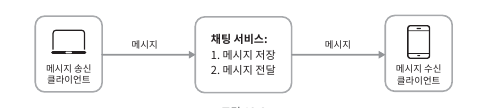
- 클라언트는 서로 직접 통신하지 않음
- 채팅 서비스는 아래 기능을 제공해야함
  - 클라이언트들로부터 메시지 수신
  - 메시지 수신자 결정 및 전달
  - 수신자가 좁속 상태가 아닌 경우에는 접속할 때가지 해당 메시지 보관
- 어떤 통신 프로토콜을 사용할 것인가도 중요한 문제
  - 채팅 프로그램 초기에 HTTP 사용
  - 메시지 수신 시나리오가 복잡하기에 서버가 연결을 만드는 것처럼 동작하는 기법 제안되어 옴
    - 폴링
    - 롱 폴링
    - 웹 소켓

##### 폴링
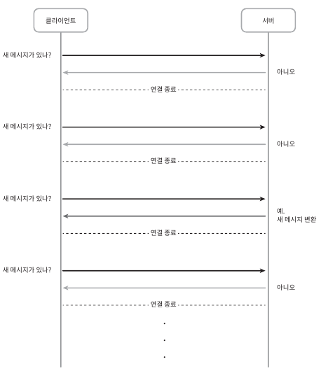
- 빈번하게 폴링할 수록 비용 증가
- 답해줄 메시지가 없는 경우 불필요한 자원 낭비
##### 롱폴링
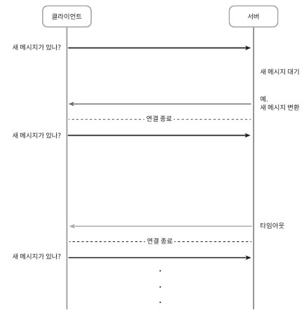
- 다음과 같은 약점 존재
  - 메시지를 보내는 클라이언트와 수신하는 클라이언트가 같은 채팅 서버에 접속하게 되지 않을 수 있음
  - 서버 입장에서 클라이언트가 연결을 해제했는지 아닌지 알 좋은 방법이 없음(keep alive connection timeout)
  - 답해줄 메시지가 없는 경우 불필요한 자원 낭비
##### 웹 소켓
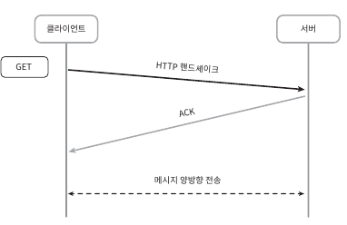
- 서버가 클라이언트에게 비동기 메시지 전송 시 쓰이는 기술
- HTTP 연결이지만 특정 핸드세이크 절자를 걸쳐 웹 소켓 연결로 업그레이드
- 80이나 443 포트를 활용하기에 일반적인 방화벽에서도 정상 작동
- 양방향 메시지 전송 가능

##### 개략적 설계안
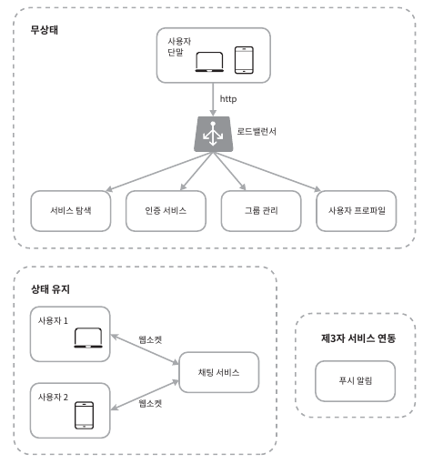
- 무상태 서비스
  - 로그인, 회원가입 및 프로파일 표시 등 일반적인 서비스 기능 
  - 모놀리틱 서비스 또는 마이크로 서비스 일수도 있음
  - 서비스 탐색 서비스: 클라이언트가 접속할 채팅 서버의 DNS 호스트명을 전달해주는 서비스
- 상태 유지 서비스(채팅 서비스)
  - 각 클라이언트가 채팅 서버와 독립적인 네트워크 연결 유지
  - 서버가 살아 있는 한 다른 서버로 연결이 변경되지 않음
  - 서비스 탐색 서비스와 긴밀히 협력하여 트래픽이 한쪽에 몰리지 않도록 해야함
- 제3자 서비스 연동(푸시 알림)
  - 앱이 실행중이지 않더라도 알림을 받기 위해 필요
- 규모 확장성\
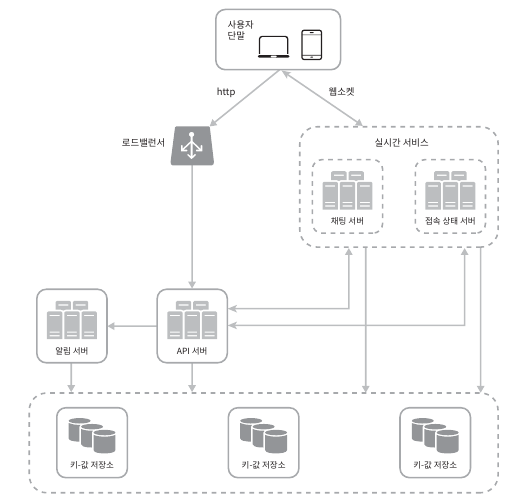
  - 서버 한대로도 가능하지만 한대로 얼마나 많은 접속을 동시에 허용 파악 중요
  - 접속당 10K의 서버 메모리만 필요하면 1M 동시 접속시 10GB만 있으면 처리 가능
  - But, 누구도 한대로 처리하려고 하지 않음 -> SPOF 발생 등의 문제
  - 실시간 메시지를 주고 받기 위해 클라이언트는 채팅서버와 웹소켓 연결 유지
    - 채팅서버: 메시지 중계 역할
    - 접속상태서버: 사용자의 접속 여부 관리
    - API 서버: 로그인, 회원가입등 그외 나머지 처리
    - 알림 서버: 푸시 알림
    - 키-값 저장소: 채팅 이력 보관
- 저장소
  - 확장이 끝났으면 데이터 계층을 올바르게 만드는게 중요
  - 채팅 시스템의 데이터는 두가지
    - 사용자 프로파일, 친구 목록 등의 일반적인 데이터 -> RDB
    - 채팅 이력 데이터 -> 키-값 저장소 추천
      - 채팅 이력 데이터의 양은 엄청남
      - 대부분의 사용자는 최근 메시지만 조회
      - 검색 등의 무작위적인 데이터 접근 필요
      - 일기와 쓰기 비율이 1:1
      - 수평 확장 쉬움
      - 접근 지연시간 낮음
- 데이터 모델
  - 1:1 채팅을 위한 메시지 테이블\
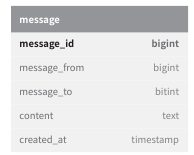
  - 그룹 채팅을 위한 테이블\
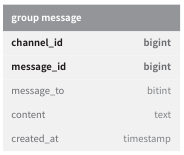
  - 메시지 ID
    - 다음과 같은 속성 만족
      - 값이 고유해야함
      - ID 값의 시간 순서와 정렬 가능
    - RDBMS의 auto_increment도 가능 -> NO SQL에서 제공하지 않음
    - 스노의 플레이크 활용 or 지역적 순서 번호 생성기(같은 그룹내 ID 생성)
## 12.3 상세 설계
- 서비스 탐색, 메시지 전달 흐름, 사용자 접속 상태 표시

##### 서비스 탐색
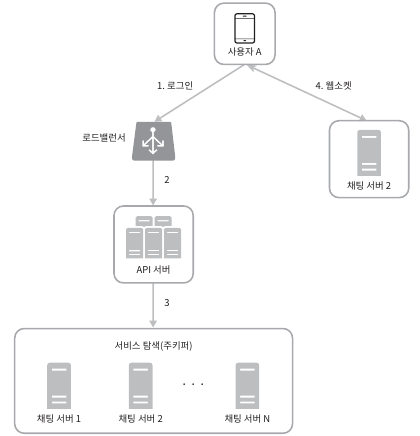
- 클라이언트 위치, 서버 용량 등을 고려하여 클라이언테에게 채팅 서버 할당
- 오픈소스로 아파치 주키퍼 존재

##### 메시지 흐름
- 1:1 채팅 메시지 처리 흐름\
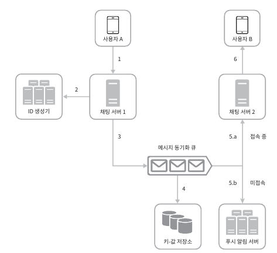
  - a: 사용자 B가 접속중이면 메시지 전달
  - b: 사용자 B가 미접속 중이면 푸시
- 여러 사이의 메시지 동기화\
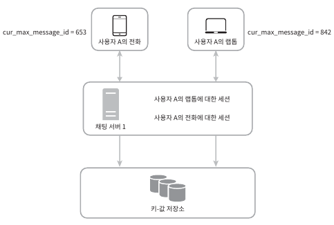
  - 아래와 같은 경우 최신 메시지로 간주
    - (수신자 ID == 로그인한 사용자 ID) && 최신 메시지 ID > cur_max_message_id 
- 소규모 그룹 채팅에서의 메시지 흐름\
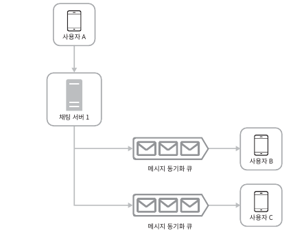
  - 각각에 할당된 메시지 수신함으로 메시지 동기화 큐 활용
  - 소규모에만 적합 -> 위챗 같은 경우 500명으로 제한
  - 아래와 같이 개선하면 더 많은 메시지 수신 가능\
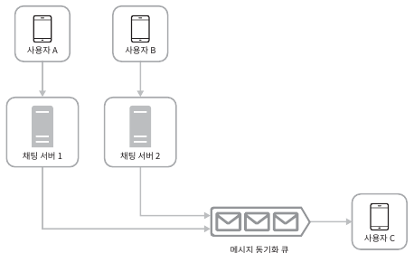\
    (?)해당 부분 이해가 잘...

##### 접속상태 표시
- 사용자 로그인\
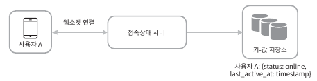
  - 사용자 로그인 기록
- 로그 아웃\
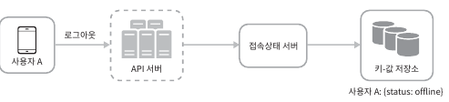
  - 오프라인 기록
- 접속 장애\
  - 네트워크 불안전으로 접속이 끊어 질 수 있음 -> 바로 상태 반영 안좋음
    - 바로 바로 오프라인 보여주면 사용성 저하 우려
  - heartBeat event를 통해 일정 시도 후 오프라인 상태로 변경\
  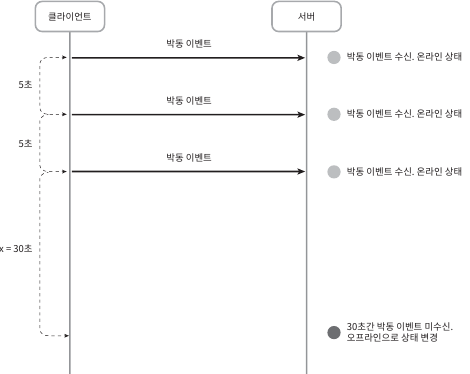
- 상태 정보의 전송\
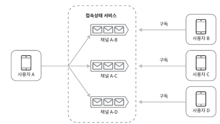
  - 상태 정보 전송은 Pub-Sub 구조로 수신
  - 각각의 친구 관계 마다 채널 -> 소규모 일때 유용
  - 대규모는? 수동 갱신이나 처음에만 반영
## 12.4 마무리
- 아래와 같은 이슈 논의
  - 채팅 앱을 확장하여 사진, 비디오 등 미디어 지원
  - 종단 간 암호화
  - 캐시: 클라이언트 캐시
  - 로딩 속도 개선: 지역적 분산 네트워크 구축
  - 오류 처리
    - 채팅 서버 오류: 주키퍼 통해 새로 배정
    - 메시지 재전송