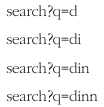

# 13. 검색어 자동완성 시스템
- 자동완성(autocomplete, typeahead, search-as-you-type, incremental search)

## 13.1 문제 이해 및 설계 범위 확정
- 빠른 응답 속도: 검색어를 입력함에 따라 자동완성 검색어도 충분히 빨리 표시
- 연관성: 사용가자 입력한 단어와 연관된 것
- 정렬: 인기도 등 순위 모델에 의해 정렬
- 규모 확장성: 많은 트래픽 감당할 수 있도록 확장 가능
- 고가용성: 시스템 일부에 장애가 발생하여도 지속적 사용 가능

##### 개략적 규모 추정
- DAU 1,000만명
- 평균적으로 한 사용자는 매일 10건의 검색을 수행
- 질의 할때마다 평균적 20바이드 데이터 입력
  - ASCII 인코딩 사용 및 1문자 = 1바이트
  - 질의문은 평균적으로 4개의 단어 및 단어 하나당 5글자 -> 5 x 4 = 20
- 검색창에 글자를 입력할 때마다 백엔드 호출, 1회 검색당 20건의 요청 호출
  - dinner라고 입력하면 아래와 같이 6개 요청 호출\
\

- 대략 초당 24,0000건의 질의 발생 -> 1,000만 x 10질의/일 x 20자/24시간/3600초
- 최대 QPS = QPS X 2 = 대략 48,000
- 질의 가운데 20%정도는 신규 검색어라고 가정할 것 -> 0.4GB -> 매일 0.4GB 추가

## 13.2 개략적 설계안 제시 및 동의 구하기 
- 개략적으로 보면 시스템은 두 부분으로 나뉨
  - 데이터 수집 서비스: 사용자가 입력한 질의를 실시간으로 수집하는 시스템, 데이터가 많은 애플리케이션에서 실시간 시스템은 바람직하지 않음 -> 추후 현실적 안으로 교체
  - 질의 서비스: 주어진 질의에 다섯 개의 인기 검색어를 정렬해 내놓는 서비스

##### 데이터 수집 서비스
- 질의 문과 사용 빈도를 저장하는 빈도 테이블이 존재\

##### 질의 서비스
- 빈도 테이블이 있는 상태에서 두 개의 필드 존재\

  - query: 질의문을 저장하는 필드
  - frequency: 질의문이 사용된 빈도를 저장하는 필드
- tw를 질의할 시 아래 그림과 같이 출력되어야 함\

- 아래와 같은 쿼리 활용\

- 데이터 양이 많아지면 병목 현상 발생되는 설계안임

## 13.3 상세 설계
- 아래 컴포넌트 상세 설계 후 최적화 논의
  - 트라이 자료구조
  - 데이터 수집 서비스
  - 질의 서비스
  - 규모 확장이 가능한 저장소
  - 트라이 연산

##### 트라이 자료구조
- RDB를 사용하여 다섯 개 질의문을 골라내는 방안은 효율적이지 않음
- 트라이(trie 또는 prefix tree) 사용하여 해결
  - 문자열들을 간략하게 저장할 수 있고, 문자열을 꺼내는 연산에 초점이 맞추어 설계된 자료구조
  - 트리 행태의 자료구조
  - 루트 노드는 빈 문자열을 나타냄
  - 각 노드는 글자 하나를 저장, 26개의 자식 노드를 가질 수 있음
- 아래 그림은 'tree','try','true','toy','wish','win'이 보관된 트라이\

- 빈도 정보까지 같이 추가하면 아래와 같음\

- 알고리즘 살펴보기 전 용어
  - p: 접두어(prefix) 길이
  - n: 트라이 안에 있는 노드 개수
  - c: 주어진 노드의 자식 노드 개수
- 가장 많이 사용된 질의어 K개는 다음과 같이 찾을 수 있음
  - 해당 접두어를 표현하는 노드 탐색 -> 시간 복잡도는 O(p)
  - 해당 노드부터 하위 트리를 탐색하여 모든 유효 노드를 탐색 -> 시간 복잡도는 O(c)
  - 유효 노드들을 정렬하여 가장 인기 있는 검색어 k를 탐색 -> 시간 복잡도는 O(clogc)
- k = 2, 검색창에 'be'라고 입력하면?\

  - 접두어 노드 'be' 탐색 -> 시간 복잡도 2(b,e)
  - 해당 노드부터 시작하는 하위 트리 탐색하여 유효 노드 찾기 -> 시간 복잡도 5
    - [beer:10],[best:35],[bet:29]가 유효노드
      (?) 유효 노드에 bee도 들어가는거 아닌가?
  - 유효 노드를 정렬하여 2개만 골라냄 -> 시간 복잡도 5log5 (3.494885)\
    (?) 5개를 가지고 정리를 한게 아닌 3개만 가지고 정렬?
  - 알고리즘 복잡도는 O(p) + O(c) + O(clogc)
- 해당 알고리즘은 최악의 경우 K개 결과를 얻으려고 전체 트라이 검색할 수 있기에 아래 문제로 해결
  - 접두어의 최대 길이를 제한
    - 사용자는 긴 검색어를 입력하는 일이 거의 없음
    - p값은 작은 정숫값(가령 50과 같은)이라고 가정해도 안전
    - 검색어의 최대 길이를 제한하면 O(p) -> O(1)로 바뀔 것
  - 각 노드에 인기 검색어를 캐시\

    - 각 노드에 k개의 인기 검색어를 저장해 두면 전체 트라이 검색 방지
      - 장점: 빠른 응답속도 지원
      - 단점: 각 노드에 질의어를 저장할 공간이 많이 필요
  - 해당 알고리즘을 적용하면 전체 시간 복잡도가 O(1)로 변경

##### 데이터 수집 서비스
- 사용자 타이핑 마다 실시간 데이터 수정 문제
  - 매일 수천만 건의 질의 때마다 트라이 갱신 -> 질의 서비스 심각하게 느려짐
  - 트라이 만들어지면 인기 검색어는 자주 바뀌지 않을 것임 -> 자주 갱신 필요 없음
- 트위터 같은 실시간 애플리케이션이라면 제안되 검색어가 신선해야함, But 구글과 같은 검색은 그럴 필요 없음
- 트라이 만드는데 쓰이는 데이터는 보통 데이터 분석 서비스 또는 로깅 서비스로부터 수집
- 아래는 데이터 분석 서비스의 수정된 설계안\

  - 데이터 분석 서비스 로그
    - 검색창에 입력된 질의에 관한 원본데이터 보관
    - create만 존재 -> Update는 없으며 인덱스도 없음\

  - 로그 취함 서버
    - 데이터 분석 서비스의 로그는 데이터양이 엄청나고 데이터 형식도 제각각 -> 데이터 취합 필요
    - 트위터 같은 실시간 앱은 취삽 주기 짧게, 대부분은 일주일에 한 번 정도로 로그 취합
  - 취합된 데이터\

    - 매주 취합한 데이터 사례
    - time: 해당 주가 시작한 날짜
    - frequency: 해당 질의가 해당 주에 사용된 횟수의 합
  - 작업 서버
    - 주기적으로 비동기적 작업(job)을 실행하는 서버 집합
    - 트라이 자료구조 생성 및 데이터베이스 저장 역할
  - 트라이 캐시
    - 분산 캐시 시스템으로 트라이 데이터를 메모리에 유지
    - 매주 트라이 데이터베이스의 스냅샷을 떠서 갱신
  - 트라이 데이터베이스
    - 지속적 저장소
    - 트라이 저장소로 사용할 두가지 선택지 존재
      - 문서 저장소: 트라이 직렬화하여 데이터베이스 저장 -> Mongo DB
      - 키-값 저장소: 아래 로직 적용하여 해시 테이블 형태로 변환 가능\

        - 트라이에 보관된 모든 접두어를 해시 테이블 키로 변환
        - 각 트라이 노드에 보관된 모든 데이터를 해시 테이블 값으로 변환

##### 질의 서비스
- 데이터베이스를 활용하여 최기 인기 검색어 5개 선정\

  - ③: API 서버는 트라이 캐시에서 데이터를 가져와 자동완성 검색어 제안 응답 구성
  - ④: 캐시에 없는 경우, 데이터베이스에서 가져옴
- 질의 서비스는 빨라야 하기에 아래와 같은 최적화 방안 고민
  - AJAX 요청
    - AjAX요청을 보내어 자동완성된 검색어 목록 수집, 페이지 새로고침 필요 없음
  - 브라우저 캐싱
    - 짧은 시간에 자동완성 검색어는 자주 변경되지 않음
    - 브라우저 캐시에 넣어두어 후속 질의의 결과를 제공
    - 구글 검색 엔진이 이런 캐시 매커니즘\

      - cache-control에 private(공용 캐시 저장 x)와 max-age=3600(1 hour)
  - 데이터 샘플링
    - 대규모 시스템의 경우, 모든 질의 결과를 로깅하도록 하면 엄청난 자원 소비
    - N개 요청 가운데 1개만 로깅하도록 변경

##### 트라이 연산
- 자동완성 시스템의 핵심 컴포넌트
  - 트라이 생성
    - 작업 서버 담당
    - 데이터 분석 서비스의 로그나 데이터베이스로부터 취합된 데이터 활용
  - 트라이 갱신
    - 두가지 방법 존재
      - 매주 한번 갱신, 새로운 트라이를 만든 다음에 기존 트라이 대체
      - 트라이의 각 노드를 개별적으로 갱신 -> 성능이 좋지 않음
      - 해당 노드 빈도가 갱신되면 관련 상위 노드들 전체 갱신 필요 

  - 검색어 삭제
    - 혐오성, 폭력적 및 성적 등 위험한 질의어는 자동 완성 결과에서 제거 필요
    - 트라이 캐시 앞에 필터 계층을 두어 부적절한 질의어 반환 되지 않게 함
    - 필터 계층을 두면 필터 규칙을 자유롭게 변경 가능\

##### 규모 확장이 가능한 저장소
- 트라이의 크기를 한 서버에 넣기엔 너무 큰 경우 대응
- 언어가 영어만 지원이라면 첫 글자를 기준으로 샤딩하는 방법
  - 검색어를 보관하기 위해 두 대 서버가 필요하다면 'a'~'m' 시작하는 검색어는 첫번째 서버, 나머지는 두번 째 서버
  - 세 대의 서버가 필요하면, 'a'~ 'i'까지 첫번째, 'j'~'r'까지는 두번째, 나머지는 세번째
- 해당 방법은 최대 26대로 제한 -> 서버 수를 더늘릴려면 계층적 샤딩 활용
  - 'a' 시작 하는 검색어를 4대로 나눌려면 'aa'~'ag', 'ah'~'an', 'ao'~'au', 나머지
- 데이터를 각 서버에 균등하게 배분하기 불가능(특정 단어 시작이 압도적으로 많은 경우도 존재)
- 문제 해결을 위해 과거 질의 데이터 패턴을 분석하여 샤딩\

  - 샤드 관리자를 통해 어떤 검색어가 어느저장소에 있는지 관리
  - 's'로 시작하는 단어가 많으면 's'는 하나의 샤드, 'x','u','y' 등 단어 숫자가 적으면 하나의 샤드로 몰아서 저장

## 13.4 마무리
- 아래와 같은 질문 던질 수 있음
  - 다국어 지원 가능으로 확장하려면?
    - 트라이에 유니코드 데이터 저장
  - 국가별 인기 검색어 순위를 다르게 하려면?
    - 국가별 다른 트라이 사용
    - 트라이를 CDN에 저장하여 응답 속도 높이는 것도 고려
  - 실시간으로 변하는 검색어의 추이를 반영하려면?
    - 현 설계안은 적합하지 않음 -> 실시간은 굉장히 복잡함
    - 아래와 같은 아이디어 존재
      - 샤딩을 통해 작업 대상 데이터의 양 축소
      - 순위 모델을 바꾸어 최근 검색어에 보다 높은 가중치 부여
      - 데이터가 스트림 형태로 올 수 있음 -> 한번에 모든 데이터 동시에 사용 불가능