# 14. 유튜브 설계
- 유튜브 시스템은 간단해 보이지만 이면에는 수많은 복잡한 기술이 숨어 있음
- 2020년 조사된 결과
  - 월간 능동 사용자 수: 2십 억
  - 매일 재생되는 비디오 수: 5십 억
  - 미국 성인 가운데 73%가 유튜브 이용
  - 5천만명의 창작자
  - 유튜브의 광고 수입은 2019년 기준 150억 달러, 2018년도 대비 36% 증가
  - 모바일 인터넷 트래픽 가운데 37%를 유튜브가 점유
  - 80개 언어로 이용 가능

## 14.1 문제 이해 및 설계 범위 확정
- 비디오 송출외에도 댓글, 좋아요 등 다양한 기능 제공
- 45 ~ 60분 내 전체 설계는 불가능이기에 적절한 질문으로 설계 범위 축소
- 아래와 같은 요구사항 필요
  - 빠른 비디오 업로드
  - 원활한 비디오 재생
  - 재생 품질 선택 기능
  - 낮은 인프라 비용
  - 높은 가용성과 규모 확장성, 그리고 안전성
  - 지원 클라이언트: 모바일 앱, 웹 브라우저, 그리고 스마트 TV

##### 개략적 규모 추정
- DAU 500만
- 한 사용자는 하루에 평균 5개의 비디오 시청
- 10%의 사용자가 하루에 1비디오 업로드
- 비디오 평균 크기는 300MB
- 매일 새로 요구되는 저장 용량 -> 5백만 x 10% x 300MB = 150TB
- CDN 비용 고려
  - 클라우드 CDN을 통해 비디오 서비스할 경우 데이터의 양에 따라 과금
  - 비용 줄이는 방안에 대해서 고려하면서 설계

## 14.2 개략적 설계안 제시 및 동의 구하기 
- 해당 설계안은 CDN과 BLOB 스토리지 활용 -> 면접관이 기존 클라우드 서비스를 이용해도 좋다고 함
  - 시스템 설계 면접은 모든 것을 밑바닥부터 만드는 것과는 관계가 없음 -> 주어진 시간 내 적절한 기술 골라서 설계
  - 규모 확장이 쉬운 BLOB 저장소나 CDN을 만드는 것은 굉장히 복잡하고 비용이 많이 듬 -> 타 회사도 클라우드 활용
- 개략적 설계안은 다음과 같음\
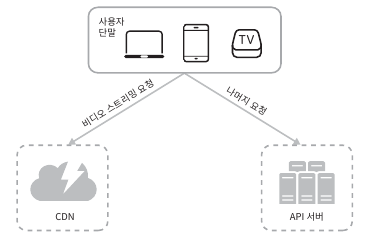
  - 단말: 컴퓨터, 모바일 폰, 스마트 TV를 통해서 유튜브 시청 가능
  - CDN: 비디오는 CDN에 저장, 재생 버튼을 누르면 CDN으로부터 스트리밍 재생
  - API 서버: 비디오 스트리밍을 제외한 모든 요청은 API 서버가 처리
- 면접관이 다음의 두 영역 설계해 줄것을 요청 가정
  - 비디어 업로드 절차
  - 비디오 스트리밍 절차

##### 비디오 업로드 절차
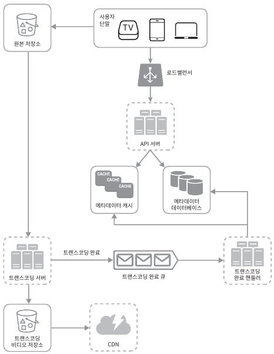
  - 사용자: 단말을 통해 유튜브를 시청하는 이용자
  - 로드밸런서: API 요청 분산 역할
  - API 서버: 비디오 스트리밍을 제외한 다른 모든 요청 처리
  - 메타데이터 데이터베이스: 비디오의 메타데이터 보관, 샤딩과 다중화를 적용하여 성능 및 가용성 요구사항 충족
  - 메타데이터 캐시: 성능을 높이기 위해 비디오 메타데이터와 사용자 객체 캐시
  - 원본 저장소: 원본 비디오를 보관할 대형 이진 파일 저장소 시스템(BLOB)
  - 트랜스코딩 서버: 비디오 인코딩 절차로 비디오 포멧 변환 과정, 단말이나 대역폭 요구사항에 맞는 최적의 비디오 스트림 제공
  - 트랜스코딩 비디오 저장소: 트랜스코딩이 완료된 비디오를 저장하는 BLOB 저장소
  - CDN: 비디오를 캐시하는 역할
  - 트랜스코딩 완료 큐: 비디오 트랜스코딩 완료 이벤트들을 보관할 메시지 큐
  - 트랜스코딩 완료 핸들러: 트랜스코딩 완료 큐에서 이벤트 데이터를 꺼내어 메타데이터 캐시와 데이터베이스에 갱신
- 비디오 업로드는 두 프로세스가 병렬적으로 수행
  - 비디오 업로드\
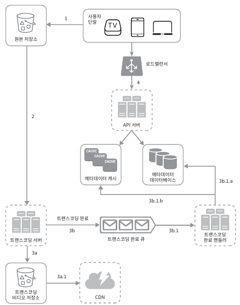
    - 1 비디오 원본 저장소에 업로드
    - 2 트랜스코딩 서버는 원본 저장소에서 해당 비디오를 가져와 트랜스코딩 시작
    - 3 트랜스코딩이 완료되면 아래 절차가 병렬적으로 수행
      - 3a완료된 비디오를 트랜스코딩 비디오 저장소로 업로드
        - 3a.1 트랜스코딩이 끝난 비디오를 CDN에 올림
      - 3b 트랜스코딩 완료 이벤트를 트랜스코딩 완료 큐에 넣음
        - 3b.1 완료 핸들러가 이벤트 데이터를 큐에서 꺼냄
        - 3b.1.a, 3b.1.b 완료핸들러가 메타데이터 데이터베이스와 캐시를 갱신
    - 4 API서버가 단말에게 비디오 업로드가 끝나서 스트리밍 준비가 되었음을 알림
  - 비디어 메타데이터 갱신(비디오 URL, 크기, 해상도, 포맷, 사용자 정보)\
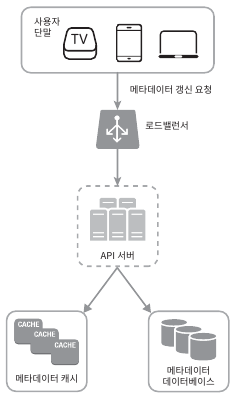
    - 원본 저장소에 파일이 업로드 되는 동안, 단말은 병렬적으로 비디오 메타데이터를 API서버에게 갱신 요청
    - API 서버는 메타데이터 캐시와 데이터베이스에 업로드

##### 비디오 스트리밍 절차
- 스트리밍 프로토콜: 비디오 스트리밍을 위해 데이터를 전송할 때 쓰이는 표준화된 통신 방법
  - MPEG-DASH
  - 애플 HLS
  - 마이크로소프트 스무드 스트리밍
  - 어도비 HTTP 동적 스트리밍
- 스트리밍 프로토콜의 동작원리 보단 프로토콜마다 지원하는 비디오 인코딩이 다르고 플레이어도 다름 -> 용도에 맞게 잘 활용해야함
- 비디오는 CDN에서 바로 스트리밍 됨 -> 사용자 단말과 가까운 CDN 에지 서버가 비디오 전송 담당

## 14.3 상세 설계
- 비디오 업로드와 스트리밍에 대한 최적화 방안과 오류 처리 메커니즘 논의

##### 비디오 트랜스코딩
- 비디오 녹화를 하면 특정 포맷으로 저장 -> 다른 단말과 호환하려면 비트레이트와 포맷으로 저장되어야 함
  - 비트레이트: 비디오를 구성하는 비트가 얼마나 빨리 처리되어야 하는지를 나타내는 단위, 비트레이트가 높으면 고화질 비디오
- 비디오 트랜스코딩은 다음과 같은 이유로 중요함
  - 가공되지 않은 원본 비디오는 저장 공간을 많이 차지함
  - 상당수의 단말과 브라우저는 특정 종류의 비디오 포맷만 지원 -> 호환성 문제 해결을 위해 여러 포맷으로 인코딩
  - 사용자에게 끊김 없는 고화질 비디오를 보장하려면 대역폭에 맞게 저화질 또는 고화질 비디오 제공
  - 모바일 단말의 경우 네트워크 상황이 수시로 달라짐 -> 비디오 화질을 자동으로 변경하거나 수동으로 변경할 수 있어야함
- 인코딩 포맷은 아주 다양하지만, 대부분 두 부분으로 구성되어 있음
  - 컨테이너: 비디오 파일, 오디오, 메타데이터를 담는 바구니 같은 것, .avi 등 파일 확장자를 보면 알수 있음
  - 코덱: 비디오 화질을 보존하면서 파일 크기를 줄일 목적으로 고안된 압축 및 압축 해제 알고리즘, H.264 등 존재

##### 유향 비순환 그래프(DAG) 모델
- 트랜스 코딩은 컴퓨팅 자원을 많이 소모하며 시간도 많이 듬
- 콘텐츠 창작자는 각자 자기만의 비디오 프로세싱 요구사항을 갖고 있음
  - 비디오 위에 워터마크 표시, 섬네일 이미지 손수 만들기 등
- 처리 과정의 병렬성을 높이기 위해 적절한 수준의 추상화 도입하여 유연성과 병렬성을 달성\
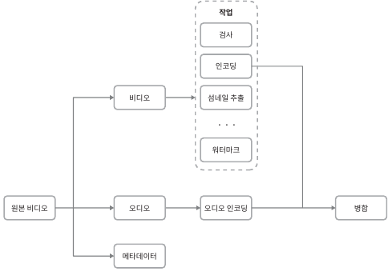
  - 검사: 좋은 품질의 비디오인지, 손상은 없는지 확인하는 작업
  - 비디오 인코딩: 비디오를 다양한 해상도, 코덱, 디트레이트 조합으로 인코딩 하는 작업\
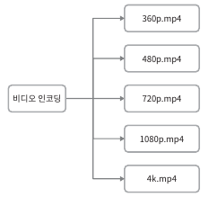
  - 섬네일: 사용자가 업로드한 이미지나 비디오에서 자동 추출된 이미지로 섬네일 생성
  - 워터마크: 비디오에 대한 식별정보를 오버레이 형태로 표시하는 작업

##### 비디오 트랜스코딩 아키텍처
- 클라우드 서비스를 활용한 비디오 트랜스코딩 아키텍쳐\
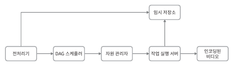
  - 전처리기
    - 비디오 분할: 비디오 스트림을 GOP(Group of pictrues)라 불리는 단위로 쪼갬
    - DAG 생성: 클라이언트 프로그래머가 작성한 설정 파일에 따라 DAG 생성\
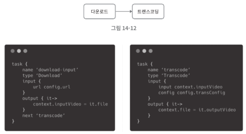
    - 데이터 캐시: 안전성을 높이기 위해 GOP와 메타데이터를 임시 저장소에 보관 -> 인코딩 실패하면 보관된 데이터 활용
  - DAG 스케쥴러
    - DAG 그래프를 몇 개 단계로 분할한 다음에 각 자원 관리자의 작업 큐에 삽입\
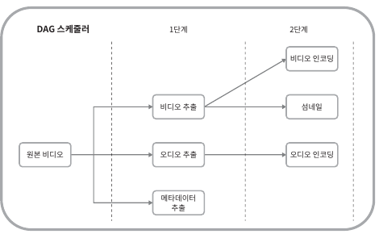
  - 자원 관리자
    - 자원 배분을 효과적으로 수행하는 역할 담당
    - 세 개의 큐와 작업 스케쥴러로 구성\
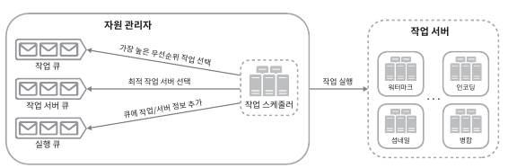
      - 작업 큐: 실행할 작업이 보관된 우선 순위 큐
      - 작업 서버 큐: 작업 서버의 가용 상태 정보가 보관되어 있는 우선 순위 큐
      - 실행 큐: 현재 실행 중인 작업 및 작업 서버가 보관되어 있는 큐
      - 작업 스케쥴러: 최적의 작업/서버 작업을 골라 작업 배치
  - 작업 실행 서버
    - DAG에 정의된 작업을 수행\
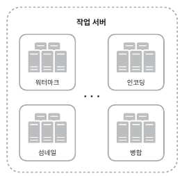
  - 임시 저장소
    - 여러 저장소 시스템을 활용 가능 -> 저장할 데이터의 유형, 크기, 이용 빈도, 데이터 유효기간 등에 따라 달라짐
      - 메타데이터는 메모리 캐시 -> 빈번히 참조 되고 크기가 작기 때문
      - 비디오/오디오 데이터는 BLOB 저장소
  - 인코딩된 비디오
    - 인코딩 파이프라인의 최종 결과물 -> fun.mp4 같은 이름을 갖음
##### 시스템 최적화
- 속도, 안전성, 비용적 측면에서의 시스템 최적화
- 속도 최적화: 비디오 병렬 업로드
  - 비디오 전부를 한 번의 업로드로 올리는 것은 비효율적 -> 하나의 비디오는 GOP들로 분할\

  - 분할한 GOP를 병렬적으로 업로드하면 설사 일부가 실패해도 빠르게 업로드를 재개 가능
  - 비디오를 GOP 경계에 맞춰 분할하는 작업을 단말이 수행하면 업로드 속도를 높일 수 있음\
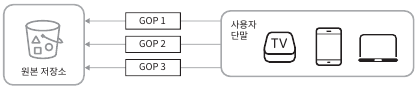

- 속도 최적화: 업로드 센터를 사용자 근거리에 지정
  - 지역별로 업로드 센터를 여러 곳에 두는 것\
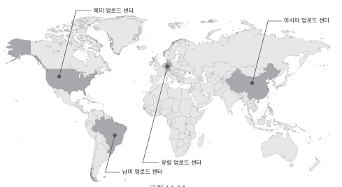
- 속도 최적화: 모든 절차를 병렬화
  - 느슨하게 결합된 시스템을 만들어서 병렬성을 높이기
  - 현재 설계안은 아래와 같음\
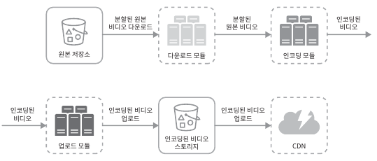
  - 해당 시스템의 결합도를 낮추기 위해 메시지 큐를 도입\
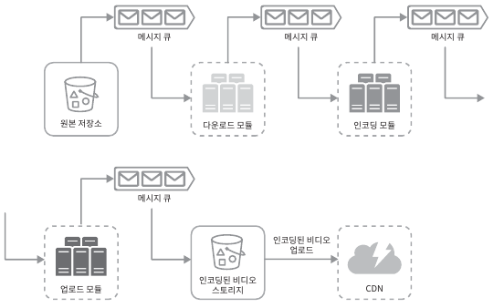
- 안전성 최적화: 미리 사인된 업로드 URL
  - 허가 받은 사용자만이 올바른 장소에 업로드 할 수 있게 미리 사인된 업로드 URL을 이용\
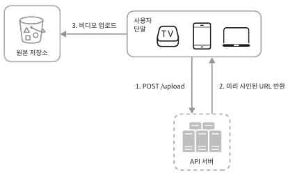
    - 클라이언트는 HTTP 서버에 POST 요청을 하여 미리 사인된 URL을 받음
    - API 서버는 미리 사인된 URL을 돌려줌
    - 클라이언트는 해당 URL이 가리키는 위치에 비디오를 업로드

- 안전성 최적화: 비디오 보호
  - 비디오 저작권 보호하기 위해 세가지 선택지 중 하나 채택 필요
    - 디지털 저작권 관리 시스템 도입: 애플 페어 플리에, 구글 와인드 바인 등이 있음 
    - AES 암호화: 비디오를 암호화 하고 접근 권한을 설정하는 방식, 재싱 시에만 복호화
    - 워터마크: 비디오 위에 소유자 정보를 포함하는 이미지 오버레이를 올리는 것

- 비용 최적화
  - CDN은 어디서든 빠르게 비디오를 시청할 수 있게 해주지만 비쌈
  - 인기있는 비디오는 빈번히 재생되는 반면 나머지는 거의 보는 사람이 없음
    - 인기 비디오는 CDN을 통해 재생하되 다른 비디오는 비디오 서버를 통해 재생\
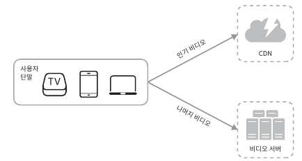
    - 인기 없는 비디오는 인코딩 할 필요가 없을 수도 있음
    - 어떤 비디오는 특정 지역에서만 인기가 높기에, 이런 비디오는 다른 지역에 옮길 필요가 없음
    - CDN을 직접 구축하고 인터넷 서비스 제공자와 제휴

##### 오류 처리
- 시스템 오류는 대형 시스템에서 불가피 -> 오류를 우아하게 처리하고 빠르게 회복해야함
- 시스템 오류는 두가지 종류 존재
  - 회복 가능 오류
    - 특정 비디오 세그먼트를 트랜스코딩하다 실패했다던가 등 회복 가능한 오류
    - 몇 번 재시도 하면 해결됨
    - 계속해서 실패하고 복구가 어려우면 클라이언트에게 적절한 오류 코드를 반환
  - 회복 불가능 오류
    - 비디오 포멧이 잘못되었다거나 하는 회복 불가능한 오류
    - 작업을 중단하고 클라이언트에게 적절한 오류 코드를 반환
- 대표적인 오류와 전형적 해결 방법
  - 업로드 오류: 몇 회 재시도
  - 비디오 분할 오류: 낡은 버전의 클라이언트가 비디오 분할하지 못하는 경우, 전체 비디오를 서버에 전송하고 서버가 분활 처리
  - 트랜스코딩 오류: 재시도
  - 전처리 오류: DAG 그래프 재생성
  - DAG 스케줄러 오류: 작업을 다시 스케쥴링
  - 자원 관리자 큐에 장애 발생: 사본을 이용
  - 작업 서버 장애: 다른 서버에게 해당 작업을 재시도
  - API 서버 장애: 다른 API 서버로 우회
  - 메타데이터 캐시 서버 장애: 데이터는 다중화 되어 있을테니, 새로운 서버로 교체
  - 메타데이터 데이터베이스 서버 장애: 주 서버가 죽었으면 부 서버 하나를 주서버로 교체, 부서버가 죽었으면 새 것으로 교체

## 14.4 마무리
- 아래사항 논의
  - API 계층의 규모 확장성 확보 방안: 무상태 서버이므로 수평적 규모 확장이 가능
  - 데이터베이스 계층의 규모 확장성 확보 방안: 다중화 및 샤딩
  - 라이브 스트리밍: 실시간 녹화하고 방송하는 절차
    - 응답 지연시간이 낮아야함 -> 스트리밍 프로토콜 선정 유의
    - 작은 단위의 데이터를 실시간으로 빨리 처리해야함 -> 병렬화 필요성이 떨어짐
    - 오류처리 방법을 달리해야함 -> 너무 많은 시간이 걸리는 방안은 사용하기 어려움
  - 비디오 삭제: 저작권 위반, 선정적등 비디오를 내려야 하는 경우 -> 업로드 과정 식별 or 사용자 신고 절차
