# 15. 구글 드라이브 설계
- 클라우드 저장소 서비스는 높은 인기를 누리게 된 대표적 클라우드 서비스 

## 15.1 문제 이해 및 설계 범위 확정
- 아래와 같은 요구사항 설계 집중
  - 파일 추가(drag-and-drop)
  - 파일 다운로드
  - 여러 단말에 파일 동기화
  - 파일 갱신 이력 조회
  - 파일 공유
  - 파일에 편집되거나 삭제되거나 새롭게 공유되었을 때 알림 표시
- 다음 기능은 논외
  - 구글 문서 편집 및 협업 기능
- 비 기능적 요구사항 이해 중요
  - 안정성: 저장소 시스템 안정성은 매우 중요, 데이터 손실 발생하면 안됨
  - 빠른 동기화 속도: 파일 동기화에 시간이 너무 많이 걸리면 안됨
  - 네트워크 대역폭: 불필요하게 많은 네트워크 대역폭이 생기면 안됨
  - 규모 확장성: 아주 많은 양의 트래픽도 처리 가능
  - 높은 가용성: 일부 서버에 장애가 발생하거나, 느려져도 시스템 지속적 사용 가능

##### 개략적 추정치
- 가입 사용자 5천만명, DAU 천만명
- 모든 사용자에게 10GB 무료 저장공간 할당
- 매일 각 사용자가 평균 2개의 파일 업로드한다고 가정, 파일의 평균 크기는 500KB
- 읽기:쓰기 비율은 1:1
- 필요한 저장 공간 총량 = 5천만 사용자 x 10GB = 500페타바이트
- 업로드 API QPS = 1천만 사용자 x 2회 업로드/24시간/3600초 = 약 240
- 최대 QPS = QPS x 2 = 480

## 15.2 개략적 설계안 제시 및 동의 구하기 
- 모든 것을 한대 서버 작동 -> 천만 사용자 지원이 가능한 시스템으로 발전
- 우선 아래와 같이 서버 한대로 시작
  - 파일을 올리고 다운로드 하는 과정을 처리할 웹서버
  - 사용자 데이터, 로그인 정보, 파일 정보 등의 메타데이터를 보관할 데이터베이스
  - 파일을 저장할 저장소 시스템. 파일 저증을 위해 1TB 공간 활용
- 아파치 웹서버, Mysql 및 drive 디렉토리 준비\
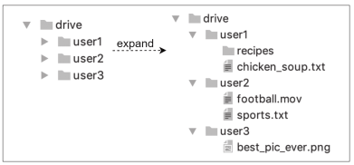

##### API
- 세가지 API가 필요
  - 파일 업로드 API
    - 두가지 종류의 업로드 지원
      - 단순 업로드: 파일 크기가 작을 때 사용
      - 이어 올리기: 파일 사이즈가 크고, 네트워크 문제로 업로드 중단 가능성이 높을 때 사용\

        - 인자
          - uploadType=resumable
          - data: 업로드할 로컬 파일
        - 이어 올리기는 세 단계 절차로 이루어짐
          - 이어 올리기 URL을 받기 위한 최초 요청 전송
          - 데이터를 업로드하고 업로드 상태 모니터링
          - 업로드에 장애가 발생하면 장애시점부터 업로드를 재시작
  - 다운로드 API\
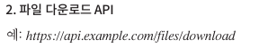
    - 인자
      - path: 다운로드할 파일의 경로\
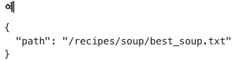
  - 파일 갱신 히스토리 제공 API\
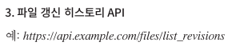
    - 인자
      - path: 갱신 히스토리를 가져올 파일의 경로
      - limit: 히스토리 길이의 최대치\
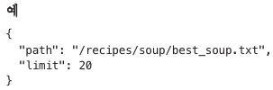
- 지금까지 나열한 API는 인증이 필요하고 HTTPS 프로토콜 활용 -> 클라이언트와 백엔드 간 주고 받는 데이터 보호

##### 한 대 서버의 제약 극복
- 업로드되는 파일이 많아디면 파일 시스템은 가득 차게 됨 -> 파일 업로드가 안됨
- 급한 해결책으로는 샤딩\
  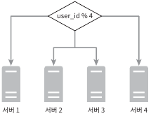
- 시장 주도 기업들은 저장소로 아마존 S3 활용\
  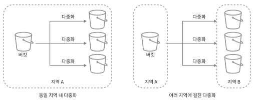
  - 규모 확장성, 가용성, 보안, 성능 등을 제공하는 객체 저장소 서비스
  - S3는 다중화를 지원 -> 데이터 손실 방지
    - 같은 지역 or 여러 지역 다중화 가능
- 아래과 같은 부분 고려
  - 로드 밸런서
    - 네트워크 트래픽 분산
    - failover 처리를 위한 트래픽 우회
  - 웹 서버
    - 로드 밸런서 추가 후 더 많은 웹 서버 쉽게 추가
    - 트래픽 폭증 대응
  - 메터데이터 데이터베이스
    - 데이터베이스를 파일 저장 서버에서 분리하여 SPOF 회피
    - 다중화 및 샤딩 정책 적용 -> 가용성과 규모 확장성 요구 대응
  - 파일 저장소
    - 가용성과 데이터 무손실 보장을 위해 두 개 이상의 지역에 데이터 다중화
- 적용 설계안\
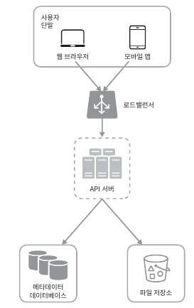

##### 동기화 충돌
- 동기화 충돌 발생 -> 다중 사용자가 같은 파일아나 폴더를 동기에 업데이트
- 동기화 충돌 해결책은?
  - 먼저 처리되는 건 변경 성공, 나중 처리되는 건 변경 충돌 발생 표시

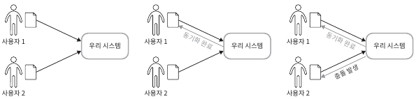

##### 개략적 설계안
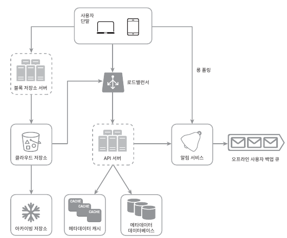
  - 블록 저장소
    - 파일 블록을 클라우드 저장소에 업로드하는 서버 
    - 클라우드 환경에서 데이터 파일을 저장하는 기술
    - 파일을 여러개의 블록으로 나눠 저장하며, 각 블록에는 고유한 해시값이 할당 -> 해시 값은 메타데이터 데이터베이스에 저장
    - 각 블록은 클라우드 저장소 시스템(S3)에 보관
    - 파일 재구성하려면 블록들을 원래 순서대로 합쳐야 함
  - 클라우드 저장소
    - 파일 블록 단위로 나눠져 클라우드 저장소에 보관
  - 아카이빙 저장소
    - 오랫동안 사용되지 않은 비활성 데이터 저장
  - API 서버
    - 파일 업로드 외에 거의 모든 것 담당
  - 메타데이터 데이터베이스
    - 사용자, 파일, 블록, 버전 등의 메타데이터 정보를 관리
    - 실제 파일은 클라우드에 보관하며, 메타데이터만 존재
  - 메타데이터 캐시
    - 성능을 높이기 위해 자주 쓰이는 메타데이터 캐시
  - 알림 서비스
    - 특정 이벤트가 발생했음을 클라이언트에게 알리는 발생/구독 프로토콜 기반 시스템
    - 클라이언트에게 파일이 추가되었거나, 편집 또는 삭제되었음을 알림
  - 오프라인 사용자 백업 큐
    - 클라이언트가 접속 중이 아닐때, 최신 상태 정보를 큐에 두어 나중에 클라이언트가 접속할 때 동기화
  
## 15.3 상세 설계
- 아래 사항 상세히 다룸
  - 블록 저장소 서버
  - 메타데이터 데이터베이스
  - 업로드 절차
  - 다운로드 절차
  - 알림 서비스
  - 파일 저장소 공간 및 장애 처리 흐름

##### 블록 저장소 서버
- 정기적으로 갱신되는 파일을 업데이트때 마다 전체 파일을 보내면 네트워크 대역폭을 많이 잡아 먹음
- 이를 최적화 하는 방법 두가지 존재
  - 델타 동기화: 전체 파일 대신 수정이 일어난 블록만 동기화
  - 압축: 블록 단위로 압축해 두면 데이터 크기를 많이 줄일수 있음
- 블록 저장소는 파일 업로드에 관계된 힘든 일을 처리하는 컴포넌트
  - 클라이언트가 보낸 파일을 블록 단위로 나눔
  - 각 블록에 압축 알고리즘을 적용 및 암호화
  - 저장소 시스템으로 수정된 블록만 전송
- 새 파일이 추가되었을 때 동작\
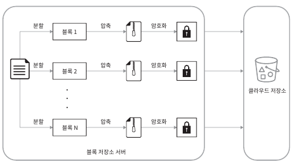
  - 주어진 파일 작은 블록 분할
  - 각 블록 압축
  - 암호화
  - 클라우드 저장소 전송
- 델타 동기화 동작\
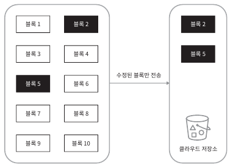
  - 갱신된 부분만 동기화
- 델타 동기화와 압축 알고리즘을 통해 네트워크 대역폭 사용량 절감

##### 높은 일관성 요구사항
- 해당 시스템은 강한 일관성 모델을 기본적으로 지원
  - 같은 파일이나 단말이나 사용자에 따라 다르게 보이면 안됨
  - 메타데이터 캐시와 데이터 베이스 계층에도 같은 원칙 적용
- 강한 일관성 보장을 위해 다음과 같은 특징 보장
  - 캐시에 보관된 사본과 데이터베이스에 있는 원본 일치
  - 데이터베이스에 보관된 원본에 변경이 발생하면 캐시에 있는 사본을 무효화
- 강한 일관성 보장이 쉬운 RDB 사용
  - RDB는 ACID를 보장하므로 강한 일관성 보장이 쉬움
  - NOSQL은 기본으로 지원하지 않기에, 동기화 로직 안에 프로그램해 넣어야 함

##### 메타데이터 데이터베이스
- 스키마 설계안\
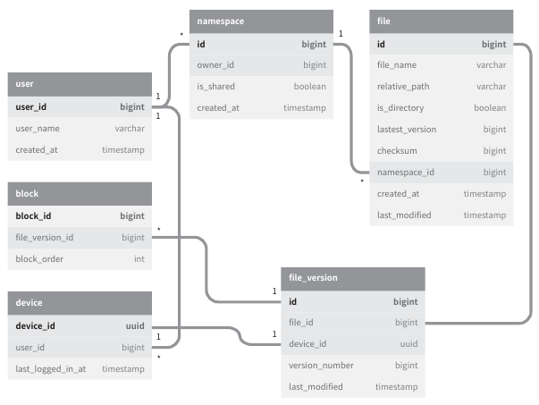
  - user: 이름, 이메일, 프로파일 사진 등 사용자에 관계된 기본적 정보
  - device: 단말 정보 보관, push_id는 푸시 알림을 보내고 받기 위함
  - namespace: 사용자의 루트 디렉터리 정보가 보관
  - file: 파일의 최신정보가 보관
  - file_version: 파일의 갱신 이력이 보관, 전부 읽기 전용
  - block: 파일 블록에 대한 정보 보관, 특정 버전의 파일을 블록 순서로 복원 가능

##### 업로드 절차
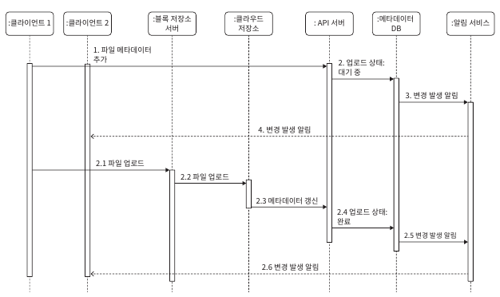
- 두 개 요청이 병렬적으로 전송된 사항
  - 파일 메타데이터 추가
    - 클라언트 1이 새 파일의 메타데이터를 추가하기 위한 요청 전송
    - 새파일의 메타데이터를 데이터베이스에 저장하고 업로드 상태를 대기증(pending)중으로 변경
    - 새 파일이 추가되었음을 알림 서비스에 통지
    - 알림 서비는 관련된 클라이언트 2에게 파일이 업로드 되고 있음을 알림
  - 파일 클라우드 저장소로 업로드
    - 클라이언트 1이 파일을 블록 저장소 서버로 업로드
    - 블록 저장소 서버는 파일을 블록 단위로 쪼갠 다음 압축하고 암호화 후 클라우드 저장소로 전송
    - 업로드가 끝나면 클라우드 스토리지는 완료 콜백 호출, 콜백 호출은 API 서버로 전송
    - 메타데이터 DB에 기록된 해당 파일의 상태를 완료로 변경
    - 알림 서비스에 파일 업로드가 끝났음을 통지
    - 알림 서비스는 클라이언트 2에게 파일 업로드가 끝났음을 알림
- 파일 수정도 유사

##### 다운로드 절차
- 클라이언트는 다른 클라이언트가 데이터를 편집하거나 추가했다는 것을 아는 방법은 아래와 같음
  - 클라이언트 A가 접속 중이고 다른 클라이언트가 파일 변경시, 클라이언트 A에게 알림을 통해 새 버전을 통지
  - 클라이언트 A가 미 접속 중이고 다른 클라이언트가 파일 변경시, 클라이언트 A가 접속중으로 바뀌면 새 버전을 받을 것임
- 아래는 파일 변경이 감지되어 새로운 파일을 받아가는 프로세스\
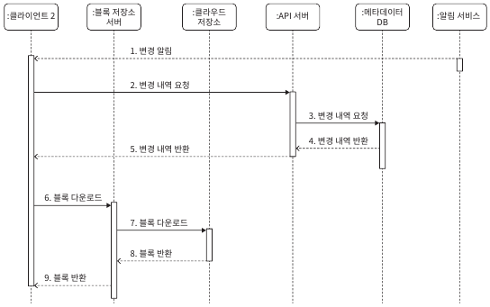
  - ① 클라이언트2는 파일 변경 알림을 전달 받음
  - ② API 서버에게 새로운 메타데이터를 요청
  - ③ API 서버는 메타데이터 데이터베이스에게 새로운 메타데이터 요청
  - ④ API 서버로 새 메타데이터가 반환
  - ⑤ 클라이언트에게 새 메타데이터가 반환
  - ⑥ 새 메타데이터를 받는 즉시 블록 다운르도 요청
  - ⑦ 블록 저장소 서버는 클라우드 저장소에게 블록 다운로드
  - ⑧ 클라우드 저장소는 블록 소버에 요청된 블록 반환
  - ⑨ 블록 저장소 서버는 클라리언트에게 요청된 블록 반환, 클라이언트2는 받은 블록을 사용하여 파일 재구성

##### 알림 서비스
- 파일 일관성을 위해 파일 변경 시, 다른 클라이언트에게 파일이 변경되었음을 알려줘야 함 -> 충돌 가능성 감소
- 알림 서비스는 이벤트 데이터를 클라이언트에게 전달, 아래와 같은 두가지 선택지 존재
  - 롱 폴링: 드롭박스가 이 방식을 채택하고 있음
  - 웹 소켓: 지속적인 통신 채널을 제공, 양방향 통신 가능
- 본 설계안은 아래와 같은 이유로 롱폴링 사용
  - 양방샹 통신이 필요하지 않음
  - 웹 소켓은 실시간 양방향 통신이 요구되는 챗팅 같은 으용에 적합, 빈번한 알림이 생길 이유가 없음
- 롱폴링 방식을 활용하면 롱폴링 연결을 유지하다 파일 변경 시, 변경 감지 및 연결이 끊김 -> 새로운 파일 다운로드 하면 새로운 연결 생성
##### 저장소 공간 절약
- 파일 갱신 이력을 보존하고 안전성 보장을 위해 여러 버전을 여러 데이터센터에 보관 필요
- 모든 버전을 자주 백업하게 되면 저장 용량이 너무 빨리 소진될 가능성 존재하기에 아래 해결 방안
  - 중복 제거
    - 중복된 파일 블록을 계정 차원에서 제거, 두 블록이 같은 블록인지는 해시 값으로 비교
  - 지능적 백업 전략을 도입
    - 한도 설정
      - 보관해야 하는 파일 버전 개수에 상한을 두는 것
      - 상한에 도달하면 제일 오래된 버전은 버림
    - 중요한 버전만 보관
      - 어떤 파일은 아주 자주 바뀜
      - 불필요한 버전과 사본이 만들어지는 것을 피하기 위해 중요한 것만 골라내기
  - 자주 쓰이지 않는 데이터는 아카이빙 저장소로 이송
    - S3 글래시어 같은 아카이빙 저장소 이용료는 S3보다 훨씬 저렴함

##### 장애 처리
- 장애 처리는 매우 중요
  - 로드밸런서 장애
    - 로드 밸런서 장애가 발생한 경우 부 로드밸런서가 활성화되어 트래픽 감당
    - heartBeat를 통해 모니터링 후 failover 처리
  - 블록 저장소 서버 장애
    - 저장소 서버 장애 발생하면 다른 서버가 미완료 상태 또는 대기상태인 작업 이어 받기
  - 클라우드 저장소 장애
    - s3 버킷은 다중화가 가능하기에, 타지역에서 데이터 가져오기 
  - API 서버 장애
    - 무상태 서버 운영으로 로드밸런서에서 정상 서버로 트래픽 우회
  - 메타데이터 캐시 장애
    - 캐시 서버 다중화 처리
  - 메타데이터 데이터베이스 장애
    - 주 데이터베이스 서버 장애: 기존 부 데이터 서버가 주로 바뀌고, 부 데이터 베이스 추가
    - 부 데이터베이스 서버 장애: 다른 부 데이터베이스가 읽기 연산 처리 및 장애 서버 새 것으로 교체
  - 알림 서비스 장애
    - 접속 중인 모든 사용자는 알림 서버와 롱 폴링 연결 유지 
  - 오프라인 사용자 백업 큐 장애
    - 다중화 처리
    - 큐에 장애 발생하면 구독 중인 클라이언트들은 백업 큐로 구독 관계 재설정

## 15.4 마무리
- 해당 시스템은 높은 수준의 일관성, 낮은 네트워크 지연, 빠른 동기화가 요구됨
- 다른 선택지 논의
  - 블록 저장소 서버를 거치지 않고 파일을 클라우드에 직접 업로드하면?
    - 장점
      - 업로드 시간이 빨라질 수 있음
    - 단점
      - 분할, 압축, 압호화 로직을 클라이언트에 두어야 하므로 플랫폼별 따로 구현
      - 클라이언트 해킹 당할 수 있기에 암호화 로직을 클라이언트에 두는건 적절하지 않음 