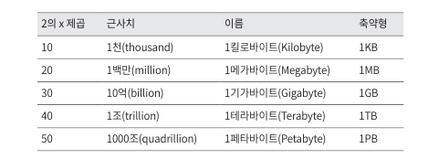
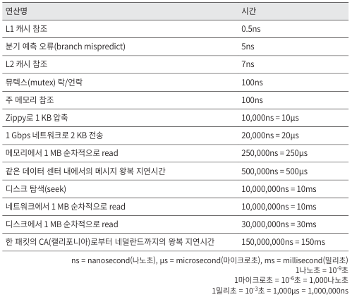
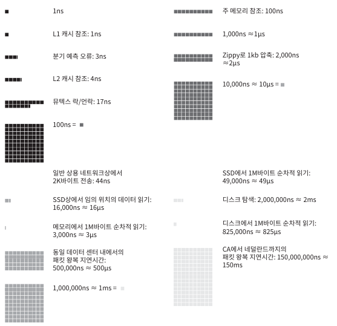
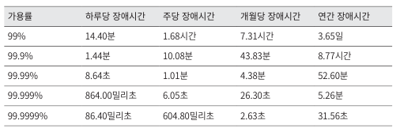
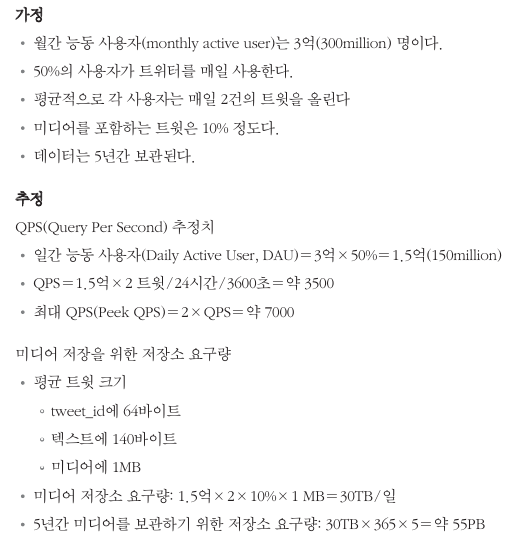

# 2. 개략적인 규모 추정
- 시스템 설계 면접에서 시스템 용량이나 성능 요구사항을 개략적으로 추정해보라는 요구사항 받음
- 개략적 규모 추정을 효과적으로 하기 위해서는 규모 확장성을 표현하는 데 필요한 기본기 필요
  - 2의 제곱수, 응답 지연 값 및 가용성에 관계된 수치

## 2.1 2의 제곱수
- 데이터 양이 엄청나게 커질수록? 데이터 불륨의 단위를 2의 제곱수를 활용하여 표현\

## 2.2 모든 프로그래머가 알아야 하는 응답지연 값
- 아래 표는 2010년 통상적인 컴퓨터 구현된 연산들의 응답 지연값\

- 아래 표는 2020년 기준으로 시각화한 수치\

## 2.3 가용성에 관계된 수치들
- 고가용성은 시스템이 오랜 시간 동안 지속적으로 중단 없이 운영될 수 있는 능력을 지칭
- SLA는 서비스 사업자가와 고객 사이에 맺어진 합의 -> 서비스 품질\

## 2.4 예: 트위터 QPS와 저장소 요구량 추정
- 필요한 데이터 스토리지와 QPS에 대해 추정\

(?) 다른 곳에서는 HW Resource에 대해 어떤식으로 측정해서 하는지... 
요즘 Redis나 Application에 대한 부하 테스트 및 사용량에 대해 측정하는 방법 고민
다른곳은 어떻게?

## 2.5 팁
- 개략적인 규모 추정과 관계된 면접에서 가장 중요한 것은 문제를 풀어 나가는 절차
- 면접자가 보고 싶어 하는 것은 문제 해결 능력
- 아래는 팁
  - 근사치를 활용한 계산: 정확한 값 도출이 목적이 아니기에 근사치로 이야기 할것
    - 99987/9.1 -> 100,000/10 으로 계산하자
  - 가정들은 적어 두라
  - 단위를 붙여라
    - 5라고만 적지 말고 5MB인지 5KB인지 명확하게 붙이기
  - 많이 출제되는 개략적인 규모 추정 문제는 QPS, 최대 QPS, 저장소 요구량, 캐시 요구량 서버수 등