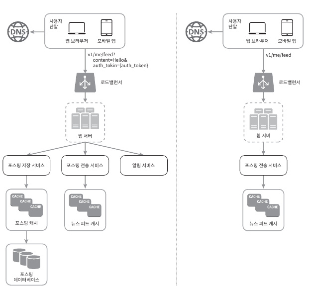
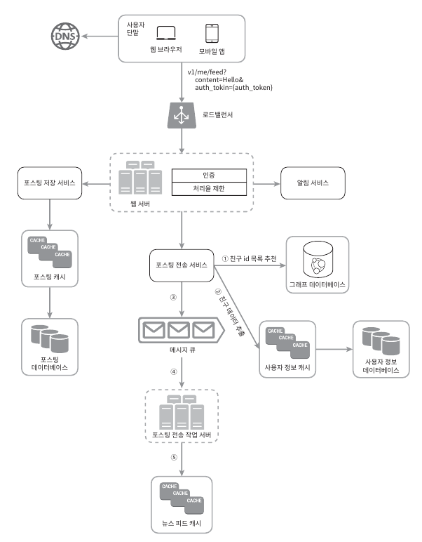
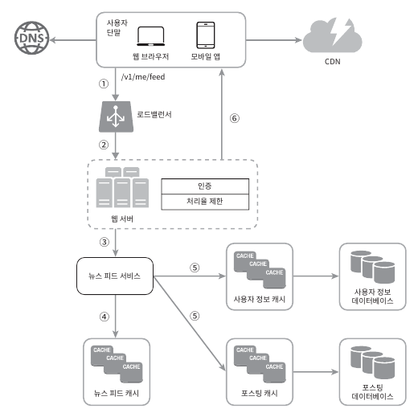

# 3. 시스템 설계 면접 공략법
- 시스템 설계 면접은 두명의 동료가 모호한 문제를 풀기 위해 협력하여 해결책을 찾아내는 과정에 대한 시뮬레이션
  - 정해진 결말도 답도 없음

## 3.1 효과적 면접을 위한 4단계 접근법
- 시스템 설계 면접은 전부 제각각이지만, 절차나 범위에 공통적인 부분 존재

### 1단계 문제 이해 및 설꼐 범위 확정
- 깊이 생각하고 질문하여 요구사항과 가정들을 분명히 하라 
  - 빨리 답하는 퀴즈 쇼가 아님
- 올바른 질문을 하는 것, 적절한 가정을 하는 것, 시스템 구축에 필요한 정보를 모으는 것 중요
- 요구사항을 정확히 이해하는 데 필요한 질문을 하라
  - 구체적으로 어떤 기능들을 만들어야 하나?
  - 제품 사용자 수는 얼마나 되나?
  - 회사의 규모는 얼마나 빨리 커지리라 예상되나?
  - 회사가 주로 사용하는 기술스택은 무엇인가?

### 2단계 개략적인 설계안 제시 및 동의 구하기
- 계략적인 설계안을 제시하고 면접관의 동의를 얻는 것
  - 설계안에 대한 최초 청사진을 제시하고 의견을 구하라
  - 화이트보드나 종이에 핵심 컴포넌트를 포함하는 다이어그램을 그려라
  - 최초 설계안이 시스템 규모에 관계된 제약사항들을 만족하는지를 개략적으로 계산해 보라
- 뉴스 피드백 시스템 설계
  - 피드 발행 (좌측 그림)
  - 피드 생성 (우측 그림)

### 3단계 상세 설계
- 설계 대상 컴포넌트 사이의 우선순위를 정하는 것
  - 중요한 부분에 대해 설명하자 -> 불필요한 곳에 시간 낭비 하지 말자
  - 대부분의 면접관은 특정 시스템 컴포넌트들의 세부사항을 깊이 있게 설명하는 것을 보길 원함
- 피드 발행 상세 설계\

- 뉴스 피드 가져오기 상세 설계\

### 4단계 마무리
- 면접관은 설계 결과물에 관련된 후속 질문 던질 수 있고 거기에 추가 논의를 진행하자
  - 면접관이 병목구간 및 개선 지점 요구
    - 완벽하다거나 개선점 없다 답 X -> 비판적 사고 능력을 보이면서 개선점 논의
  - 만든 설계를 다시 요약해주기
    - 면접관의 기억을 환기시켜주는 효과
  - 오류가 발생하면 무슨 일이 생기는지 따져보기
  - 운영 이슈 논의
    - 메트릭, 로그, 시스템 배포 등 고려
  - 미래에 닥칠 규모 확장 고려
  - 세부 개선 사항 제안
- 해야 할 것
  - 질문을 통해 확인하라
  - 문제의 요구사항을 이해하라
  - 정답이나 최선의 답안 같은 것은 없다는 점을 명심
  - 면접관과 소통하라
  - 여러 해법을 함께 제시하라
  - 가장 중요한 컴포넌트부터 진행하라
  - 면접관의 아이디어를 이끌어 내라
  - 포기하지 말라
- 하지 말아야할 것
  - 전형적인 면접 문제 조차 준비하지 않은 채로 면접장 가지 말라
  - 요구사항이나 가정들이 분명하지 않은 상태로 설계를 제시하지 말라
  - 처음부터 특정 컴포넌트의 세부사항을 깊이 설명하지 말자 -> 청사진부터 그리고 나서 하자
  - 진행 중 막혔다면, 힌트를 청하기를 주저하지 말라
  - 소통을 주저하지 말라
  - 면접관이 끝났다고 말하기 전까지 끝났다고 생각하지 말자