# 4. 처리율 제한 장치의 설계
- 클라이언트 또는 서비스가 보내는 트래픽의 처리율을 제어하기 위한 장치
  - HTTP를 예로 들면 클라이언트의 요청 횟수를 제한
  - 요청 횟수가 제한 임계치(threshhold)를 넘어서면 중단 처리
- 처리율 제한 장치를 두면 이점
  - DOS공격에 의한 자원 고갈을 방지
  - 비용 절감 -> 불필요한 요청 처리를 위한 서버를 두지 않아도 됨
  - 서버 과부하를 막음

## 4.1 문제를 이해 및 설계 범위 확정
- 처리율 제한 장치를 구현하는데 있어 여러가지 알고리즘 사용 가능 -> 각각 장단점 존재
- 인터뷰를 통해 하기와 같은 조건 존재
  - 설정된 처리율을 초과하는 요청은 정확하게 제한
  - 낮은 응답시간: 처리율 제한 장치는 HTTP 응답시간에 나쁜 영향을 주면 안됨
  - 가능한 적은 메모리 활용해야 함
  - 분산형 처리율 제한: 하나의 처리율 제한 장치를 여러 서버나 프로세스에서 공유
  - 예외 처리: 요청이 제한되었을 때는 그 사실을 사용자에게 분명하게 제공
  - 높은 결함 감내성: 
## 4.2 개략적 설계안 제시 및 동의 구하기
#### 처리율 제한 장치는 어디에 둘 것인가?
- 클라이언트에 둔다면?
  - 클라이언트는 위변조가 가능하기에 안정적으로 제한 걸기가 어려움
- 서버에 둔다면?
  - 서버에 두는 방법\

  - 미들웨어로 만들어 서버로 가는 요청 통제하는 방법 -> 요청이 많을 시 status 429 내려지는 시나리오\
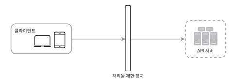\
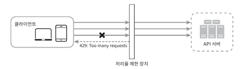
  - cloud MicroService와 같은 경우, 보통 API gateway라 불리는 컴포넌트에 구현
- 처리율 제한 장치를 설계할 때 위치를 정하는 것은 중요한 부분
- 위치에 대한 정답은 없음 -> 회사 기술스택, 우선 순위등으로 달라질 수 있음

#### 처리율 제한 알고리즘
- 처리율 제한 알고리즘은 여러가지이며, 각기 장단점을 갖고 있음
  - 토큰 버킷
    - 폭 넓게 이용되고 있는 알고리즘
    - 동작 원리
      - 최대 N개의 토큰만 채워지고, 매초 M개씩 채워짐
      - 사용 시 토큰은 소비되고, 다른 요청에 대해 토큰이 없을 시 요청은 버려짐
      - 알고리즘 인자
        - 버킷 크기: 버킷에 담을 수 있는 토큰의 최대 개수
        - 토큰 공급률: 초당 몇 개의 토큰이 버킷에 공급
    - 장점
      - 구현이 쉬움
      - 메모리 사용 측면에서도 효율적
      - 짧은 시간에 집중되는 트래픽도 처리 가능, 버킷에 남은 토큰이 있기만 하면 요청은 시스템에게 전달
    - 단점
      - 버킷 크기와 토큰 공급률을 적절히 튜닝하기가 까다로움\
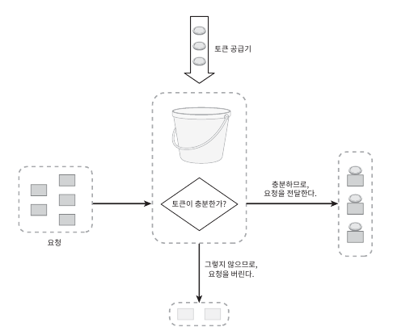\
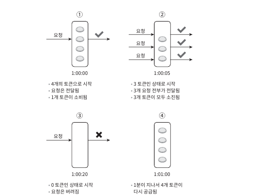
  - 누출 버킷
    - 요청 처리율이 고정되어 있는다는 점이 토큰 버킷과 다름, FIFO 큐로 구현됨
    - 동작 원리
      - 요청이 오면 큐를 확인하고, 큐가 빈자리가 있으면 큐에 요청 추가
      - 큐가 가득차 있는 경우에는 새 요청을 버림
      - 지정된 시간 마다 큐에서 요청을 꺼내어 처리
    - 파라미터
      - 버킷 크기: 큐 사이즈와 같은 값
      - 처리율: 지정된 시간당 몇 개의 항목을 처리할지 지정하는 값, 보통 초 단위로 표현
    - 장점
      - 큐의 크기가 제한되어 있어 메모리 사용량 측면에서 효율적
      - 고정된 처리율을 갖고 있기 때문에 안정적 출력이 필요한 경우 적합
    - 단점
      - 단시간 많은 트래픽이 몰리는 경우 큐에는 오래된 요청들이 쌓여 최신 요청들이 버려짐
      - 두개의 인자를 가지고 올바르게 튜닝이 어려움\
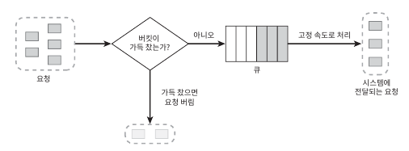
  - 고정 윈도 카운터
    - 동작 원리
      - 타임라인을 고정된 간격의 윈도로 나누고, 각 윈도마다 카운터를 붙임
      - 요청이 접수될 때마다 이 카운터의 값이 1씩 증가
      - 카운터가 임계치에 도달하면 새로운 요청은 새 윈도가 열릴 때까지 버려짐
    - 윈도의 경계 부근에 순간적으로 많은 트래픽이 집중될 경우 할당된 양보다 많은 요청 처리될 이슈 존재
      - 분에 5개가 임계치이고 분 단위로 갯수 초기화
      - 아래와 같이 윈도 경계 부근에 더 많은 양에 트래픽이 들어올 수 있음\
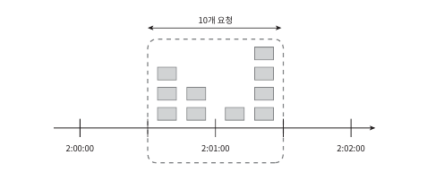
    - 장점
      - 메모리 효율이 좋음
      - 이해하기가 쉬움
      - 특정한 트래픽 패턴을 처리하기에 적합함
    - 단점
      - 윈도 경계 부근에 일시적으로 많은 트래픽이 몰리면 경우 발생
  - 이동 윈도 로그
    - 고정 윈도가 가지는 윈도 경계 부근에 트래픽이 집중되는 문제 해결
    - 동작 원리
      - 요청의 타임스탬프를 추적 -> 타임스탬프트 보통 레드스의 정렬 집합과 같은 캐시에 보관
      - 새 요청이 오면 만료된 타임스탬프는 제거
      - 새 요청의 타임스탬프를 로그에 추가
      - 로그의 크기가 허용치 보다 같거나 작으면 요청 전달\
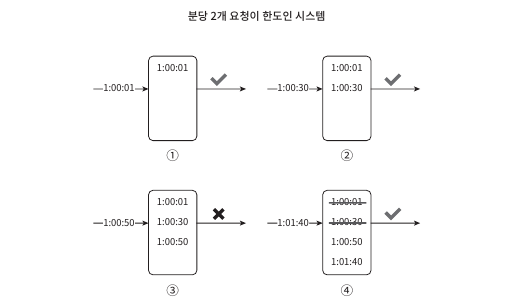
    - 장점
      - 구현하는 처리율 제한 메커니즘은 아주 정교  
    - 단점
      - 다량의 메모리를 사용 -> 거부된 요청의 타임스탬프도 보관
  - 이동 윈도 카운터
    - 고정 윈도 카운터 + 이동 윈도 로깅 알고리즘 결합
    - 2가지 접근법 존재
    - 동작 원리
      - 분당 시간을 제한이 걸렸다면 % 이동을 통해 세세한 요청 횟수 계산 
        - 현재 1분간 요청 수 + 직전 1분간의 요청 수 x 이동 윈도와 직전 1분이 겹치는 비율
        - 3 + 5 x 70% = 6.5 -> 소수점 내림 처리면 현재까지 1분간 6개 요청이 왔다고 봄\
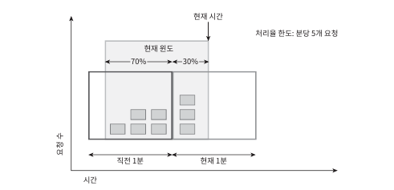
    - 장점
      - 이전 시간대의 평균 처리율에 따라 현재 윈도의 상태를 계산 -> 짧은 시간에 몰리는 트래픽에 좋음
      - 메모리 효율이 좋음
    - 단점
      - 요청이 균등하다는 가정이 들어가며, 추정치이기에 실제와 맞지 않는 경우도 존재 -> 40억개 요청 중 부 정확성 0.003%라 함

#### 개략적인 아키텍처
- 카운터를 추적할 대상은?
  - 사용자별, IP 주소별, API 엔드포인트나 서비스 단위
- 카운터는 어디에 보관?
  - 데이터베이스 x -> 너무 느림
  - 메모리상 동작하는 캐시 활용 -> 빠르고 시간에 기반한 만료 정책을 지원
    - redis의 INCR 와 EXPIRE 두가지 명령어 지원
      - INCR: 메모리에 저장된 카운터의 값을 1만큼 증가
      - EXPIRE: 카운터에 타임아웃 값 설정 -> 설정된 시간이 지나면 자동 삭제\
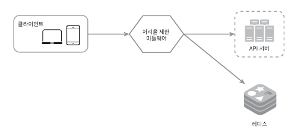

## 4.3 상세 설계
- 개략적인 설계를 봐서는 아래와 같은 사항을 알수가 없음
  - 처리율 제한 규칙은 어떻게 만들어지고 어디에 저장되는가?
  - 처리가 제한된 요청들은 어떻게 처리가 되는가?

#### 처리율 제한 규칙
- 리프트는 처리율 제한에 오픈 소스를 사용
- 이런 규칙들은 보통 설정 파일 형태로 디스크에 저장\
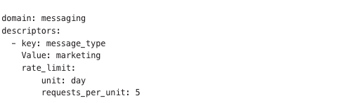

#### 처리율 한도 초과 트래픽의 처리
- 어떤 요청이 한도 제한에 걸리면 HTTP 429 응답(too many requests)을 클라이언트에게 전달
- 경우에 따라서는 한도 제한에 걸린 메시지를 나중에 처리하기 위해 큐에 보관
- 처리율 제한 장치가 사용하는 HTTP 헤더
  - 클라언트는 자기 요청이 처리율 제한에 걸리고 있는지를 어떻게 감지? HTTP 응답 헤더
    - X-Ratelimit-Remaining: 윈도 내에 남은 처리 가능 요청의 수
    - X-Ratelimit-Limit: 매 윈도마다 클라이언트가 전송할 수 있는 요청의 수
    - X-Ratelimit-Retry-After: 한도 제한에 걸리지 않으려면 몇 초 뒤에 요청을 다시 보내야 하는지 알림
- 상세 설계\
  - 레디스 역할은 요청에 대한 카운터 역할
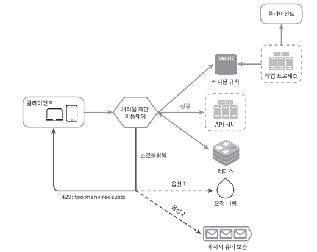

#### 분산 환경에서의 처리율 제한 장치의 구현
- 여러 대의 서버와 병렬 스레드를 지원하도록 시스템을 확장하는 것은 아래와 같은 문제를 가짐
  - 경쟁 조건
  - 동기화
- 경쟁 조건
  - 병행성이 심한 환경에서는 아래와 같은 경쟁 이슈 발생\
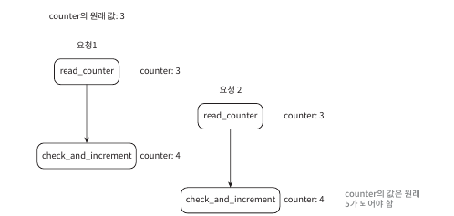
  - 경쟁 조건 문제를 해결하는 보편적인 방법은 lock, But 성능을 떨어트림
  - 락 대신 쓸수 있는 해결책
    - 루아 스크립트
    - 정렬 집합이라 불리는 레디스 자료구조
      (?) 레디스는 싱글 스레드라 데이터 무결성을 보장해주지 않나? 위와 같은 경쟁 이슈가 일어날 수 있을까?
- 동기화 이슈
  - 동기화 하지 않으면 같은 요청에 대한 제한이 유효하지 않음\ 
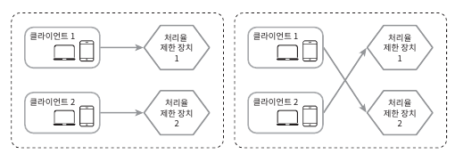
  - 해결책
    - sticky session 활용 -> 부하가 몰릴 가능성이 높고, 유연하지 않음
    - 레디스와 같은 중앙 집중형 데이터 저장소 활용\
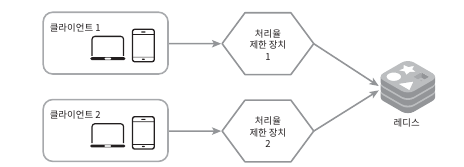
- 성능 최적화
  - 지금까지의 설계는 두가지 지점에서 개선이 가능
    - 여러 데이터센터를 지원하는 문제
      - 엣지 서비를 두어 지연시간 감소
    - 제한 장치 간 데이터를 동기화할 때 최종 일관선 모델 사용
      - '키-값 저장소 설계'의 '데이터 일관성' 항목 참고 
- 모니터링
  - 처리율 제한 장치가 효과적으로 동작하는지 확인 필요
    - 채택된 처리율 제한 알고리즘이 효과적인지
    - 정의한 처리율 제한 규칙이 효과적인지
  - 성능 이슈가 있을 시 알고리즘 변경 등을 통해 완화시키자

## 4.4 마무리
- 다른 이슈도 언급하면 도움이 될 것임
  - 경성(hard) 또는 연성(soft) 처리율 제한
    - 경선 처리율 제한: 요청 개수가 임계치를 절대 넘을 수 없음
    - 연성 처리율 제한: 요청 개수가 잠시 동안은 임계치를 넘을 수 있음
  - 다양한 계층에서의 처리율 제한
    - iptable을 통한 네트워크 계층에서도 처리율 제한 가능
  - 처리율 제한을 회피하는 방법 -> 클라이언트쪽에 설계
    - 클라이언트 측 캐시를 사용하여 API 호출 횟수 줄임
    - 짧은 시간 동안 너무 많은 메시지를 보내지 않게 처리
    - 예외나 에러를 처리하는 코드를 도입하여 클라이언트가 예외적 상황으로부터 우아하게 복구
    - 재시도 로직을 구현할 때 충분한 백오프 시간 두기