# 5. 안정 해시 설계
- 수평적 규모 확장성을 달성하기 위해서는 요청 또는 데이터를 서버에 균등하게 나누는 것이 중요
- 안정 해시가 이러한 목표를 달성해주기 위한 기술

## 5.1 해시 키 재배치 문제
- N개의 캐시 서버가 있다고 가정하고, 부하를 균등하게 나누는 보편적인 방법은 아래 해시 함수를 활용\
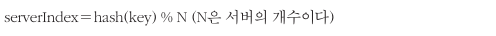
- 네개의 캐시 서버가 있다고 하면 아래와 같이 부하가 배치될 것임\
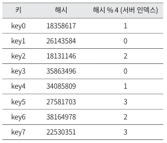\
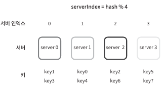
- 해당 방법은 서버 풀의 크기가 고정적이 었을 때 분포가 고르지만, 아래와 같이 서버가 추가되거나 삭제되면 문제가 발생함\
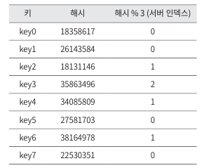\
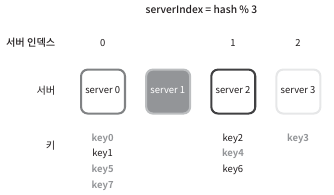

## 5.2 안정 해시
- 해시 테이블 크기가 조정될 때, 평균적으로 오직 k/n개의 키만 재배치하는 해시 기술
  - k: 키의 개수
  - n: 슬롯(slot)의 개수 
##### 해시 공간과 해시 링
- 해시 함수 f는 SHA-1을 사용하고 출력 값 범위는 x0 ~ xn 과 같다고 가정하면, 출력 범위는 0 ~ 2(160승) - 1 임\
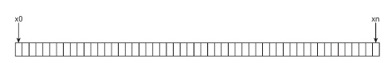
- 여기서 구부리면 아래와 같은 해시 링(hash ring)이 만들어짐\
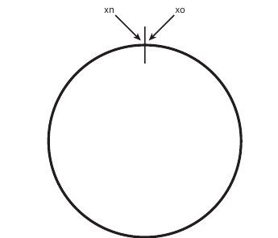
##### 해시 서버
- 해시 함수 f를 사용하면 서버 IP나 이름을 이 링위의 어떤 위치에 대응 시킬 수 있음\
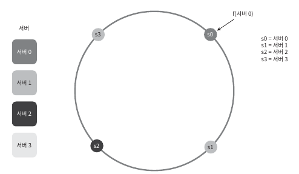
##### 해시 키
- 연산 %을 사용하지 않고, key를 해시 링위의 어느 지점에 배치 가능\
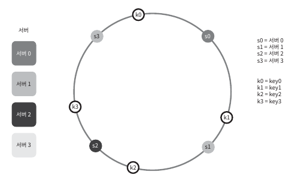
##### 서버 조회
- 어떤 키가 저장된 서버는, 해당 키의 위치로 부터 시계 방향으로 링을 탐색해서 만나는 첫번 째 서버\
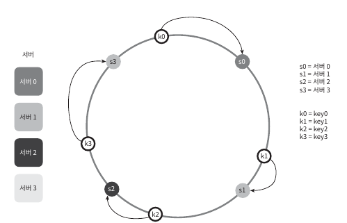
##### 서버 추가
- 서버를 추가하더라도 키 가운데 일부만 재배치하면 됨\
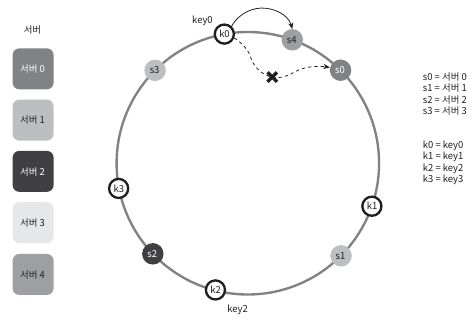
##### 서버 제거
- 하나의 서버가 제거되면 키 가운데 일부만 재배치됨\
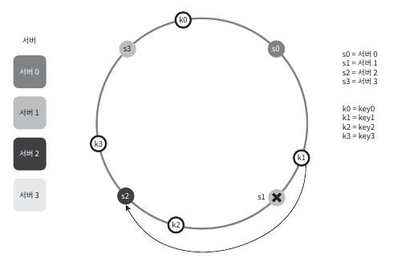
##### 기본 구현법의 두가지 문제
- 아래 기본 절차에 대한 접근법은 두가지 문제가 존재
  - 서버와 키를 균등 분포 해시 함수를 사용해 해시 링에 배치
    - 파티션의 크기(인접한 서버 사이의 해시 공간)를 균등하게 유지하는 게 불가능\
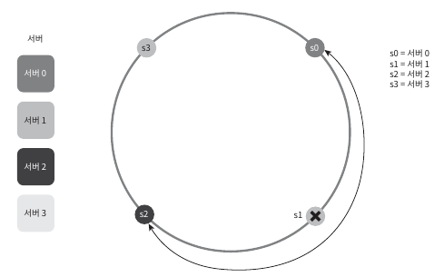
  - 키의 위치에서 링을 시계 방향으로 탐색하다 만나는 최초의 서버가 키가 저장될 서버
    - 키의 균등 분포를 달성하기 어려움\
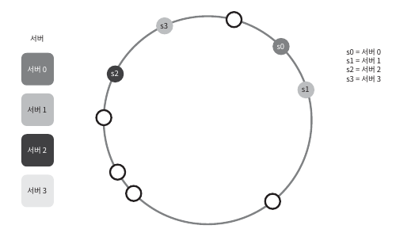
- 위와 같은 문제를 해결하기 위해 가상노드 또는 복제라 불리는 기법
##### 가상 노드
- 실제 노드 또는 서버를 가리키는 노드로서, 하나의 서버는 링 위에 여러 개의 가상 노드를 가질 수 있음
  - 아래 그림에서 서버0과 서버 1은 3개의 가상노드를 가짐\
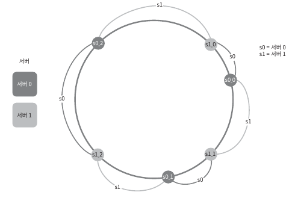
  - 키의 위치로부터 시계방향으로 링을 탐색하다 만나는 최초의 가상 노드가 해당 키가 저장될 서버\
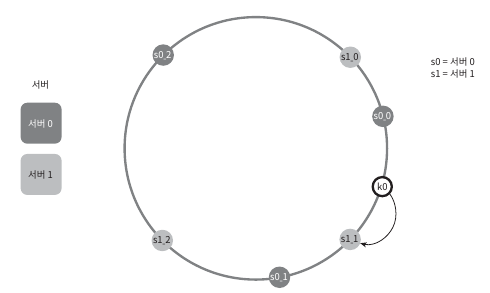
- 가상 노드의 개수를 늘리면 키의 분포는 점점 균등 -> 다상 노드 데이터를 저장할 공간이 더 많이 필요해지기에 타협이 필요
##### 재배치할 키 결정
- 서버가 추가되거나 제거되면 데이터 일부는 재배치해야함\
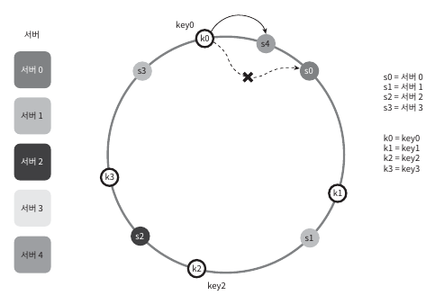\
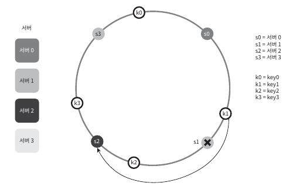

## 5.3 마치며
- 안정 해시의 이점
  - 서버가 추가 되거나 삭제될 때 재배치되는 키의 수가 최소화
  - 데이터가 균등하게 분포하게 되므로 수평적 규모 확장성을 달성하기 쉬움
  - 핫 스팟 키 문제를 줄여줌