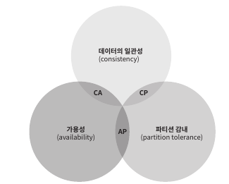
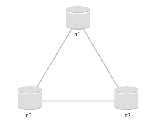
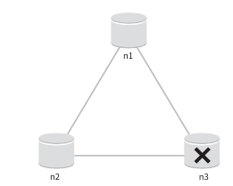
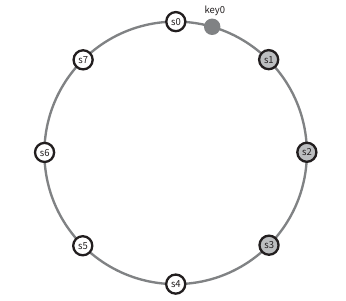

# 6. 키-값 저장소 설계
- 키-값 데이터 베이스라고도 불리는 비 관계형 데이터베이스
- 저장소에 저장되는 값은 고유 식별자를 키로 가져야 함
  - 키는 일반 텍스트 일수도 있고 해시 값일수 있음
  - 성능상 키는 짧을수록 좋음
- 값은 무엇이 오든 상관 없음
  - 리스트(list)일수도 객체(object)일수도 있음

## 6.1 문제 이해 및 설계 범위 확정
- 읽기, 쓰기 그리고 메모리 사용량 사이에 어떤 균형을 찾고 데이터의 일관성과 가용성 사이에서 타협적 결정을 내린 설계 필요
- 다음 특성을 갖는 키-값 저장소를 설계
  - 키-값 쌍의 크기는 10KB 이하
  - 큰 데이터를 저장할 수 있어야 함
  - 높은 가용성을 제공해야함
  - 높은 규모 확장성을 제공해야함 -> 트래픽 양에 따라 자동적으로 서버 증설/삭제가 이루어야져함
  - 데이터 일관성 수준은 조정이 가능해야함
  - 응답 지연시간이 짧아야함

## 6.2 단일 서버 키-값 저장소
- 한대 서버만 사용하는 키-값 저장소를 설계하는건 쉬움
- 가장 직관적인 방법은 키-값 쌍 전부를 메모리에 해시 테이블로 저장하는 것
- 해당 접근법은 빠른 속도를 보장하지만 모든 데이터를 메모리 안에 두는 것이 불가능
- 위와 같은 문제 개선책은 다음과 같음
  - 데이터 압축
  - 자주 쓰이는 데이터만 메모리에 두고 나머지는 디스크에 저장
- 개선을 해도 결국 한 대 서버로는 부족한 때가 곧 찾아옴

## 6.3 분산 키-값 저장소
- 분산 해시 테이블이라고도 불림
- 분산 시스템을 설계할 때는 CAP 정리를 이해해야함

##### CAP 정리
- 데이터 일관성, 가용성, 파티션 감내라는 세 가지 요구사항을 동시에 만족하는 분산 시스템을 설계하는 것은 불가능하다는 정리
  - 데이터 일관성: 모든 클라이언트는 언제나 같은 데이터를 보게 됨
  - 가용성: 일부 노드가 장애 발생해도 항상 응답 받을 수 있어야 함
  - 파티션 감내: 네트워크 파티션이 생겨도 시스템 계속 작동 -> 파티션은 두 노드 사이에 통신 장애가 발생하였음을 의미
- CAP 정리는 이들 가운데 두가지를 충족하려면 나머지 하나는 반드시 희생되어야함을 의미\

  - CP 시스템: 가용성 희생
  - AP 시스템: 데이터 일관성 희생
  - CA 시스템: 일관성과 가용성을 지원하는 키-값 저장소. 실세계에서는 존재하지 않음
- 이상적 상태
  - 네트워크 파티션되는 상황 일어나지 않으며, 데이터 일관성과 가용성도 만족\

- 실세계 분산 시스템
  - 분산 시스템은 파티션 문제를 피할 수 없음, 파티션 문제가 발생하면 일관성 or 가용성 중 하나를 선택해야 함\

    - 가용성 대신 일관성 선택(CP 시스템)
      - 데이터 불일치 문제 피하기 -> n1, n2 쓰기 연산 중단 -> 가용성 깨짐
      - 은행권 시스템에서 주로 사용
      - 네트워크 파티션 문제 발생 -> 정상화 될때까지 오류 반환
    - 일관성 대신 가용성 선택(AP 시스템)
      - 낡은 데이터를 제공할지라도, 계삭 읽기 연산을 허용 -> n1, n2 계속 쓰기 연산 허용
      - 정상화 되면 새로운 데이터는 n3에 전송
- 요구사항에 맞춰 위와 같이 설계할 것

## 6.4 시스템 컴포넌트
- 키-값 저장소 구현에 사용될 핵심 컴포넌트들 및 기술들
  - 데이터 파티션
  - 데이터 다중화(replication)
  - 일관성
  - 일관성 불일치 해소
  - 장애 처리
  - 시스템 아키텍처 다이어그램
  - 쓰기 경로
  - 읽기 경로
  
##### 데이터 파티션
- 대규모 애플리케이션은 한대 서버에 전체 데이터를 다 넣는건 불가능
- 해결책으로 데이터를 작은 파티션들로 분할한 다음 여러 서버에 저장하는 것
- 데이터를 파티션 단위로 나눌 때는 두가지 문제 중요
  - 데이터를 여러 서버에 고르게 분산할 수 있는가
  - 노드가 추가되거나 삭제될 때 데이터의 이동을 최소화할 수 있는가
- 해당 문제는 안정 해시를 사용하여 해결
  - 규모 확장 자동화: 시스템 부하에 따라 서버가 자동으로 추가되거나 삭제 되도록 가능
  - 다양성: 각 서버의 용량에 맞게 가상 노드의 수를 조정 가능, 고성능 서버는 더 많은 가상 노드 갖게 설정

##### 데이터 다중화
- 높은 가용성과 안정성 확보를 위해 데이터를 N개 서버에 비동기적으로 다중화 필요
  - N은 튜닝 가능한 값
  - 아래 그림은 N=3 으로 두어 key0 값에 대해 s1~s3까지 저장\

- 가상 노드를 사용하면 N개의 노드가 대응될 실제 물리 서버의 개수가 N보다 작아질 수 있음 -> 같은 물리서버를 중복 선택하지 않도록 처리 필요
  - 예) S1, S2, S3 총 3개의 가상 노드를 선택했는데 해당 노드와 연결된 서버는 2개 -> 데이터 저장 중복 발생
- 같은 데이터 센터에 속한 노드는 정저느 네트워크 이슈 등의 문제를 동시에 겪을 가능성 존재 -> 데이터의 사본은 다른 센터의 서버에 보관

##### 데이터 일관성
- 여러 노드에 다중화된 데이터는 적절히 동기화가 되어야함
- 정족수 합의 프로토콜을 사용하면 읽기/쓰기 모두 일관성 보장
  - N: 사본 개수
  - W: 쓰기 연산에 대한 정족수
  - R: 읽기 연산에 대한 정족수
  - N=3인 경우