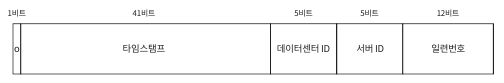

# 7. 분산 시스템을 위한 유일 ID 생성기 설계
- 분산 시스템에서 DB의 auto_increment 사용 지양 -> 분산 시스템에서 서버 한대로 감당 불가

## 7.1 문제 이해 및 설계 범위 확장
-  ID를 만드는 지원자 예시 내용 -> ID에 대한 요구사항이 함축되어 있음
  - ID는 유일해야 함
  - ID는 숫자로 구성되어야 함
  - ID는 64비트로 표현될 수 있는 값이어야 함
  - ID는 발급 날짜에 따라 정렬 가능해야 함
  - 초당 10,000개의 ID를 만들 수 있어야함

## 7.2 개략적 설계안 제시 및 동의 구하기
- 분산 시스템에서 유일성이 보장되는 ID를 만드는 방법
  - 다중 마스터 복제
  - UUID
  - 티켓 서버
  - 트위터 스노우플레이크 접근법

##### 다중 마스터 복제

- 데이터 베이스의 auto_increment 기능을 활용하는 것
- ID 값을 1씩 증가가 아닌 이전 값의 K(서버수)만큼 증가 -> DB를 늘리면 K 값도 DB 수만큼 또 늘리면 됨
  - 총 서버가 2대면 서버 1은 1, 3(1+2),5(3+2) 씩 증가
- 해당 시스템 단점
  - 여러 데이터 센터에 걸쳐 규모를 늘리기 어려움\
    (?) 이부분은 왜? 응답성이 늦어지는 이슈 때문에?
  - ID의 유일성은 보장되겠지만 그 값이 시간 흐름에 맞춰 커지도록 보장 불가능
    (?) 이유를 모르겠음?
  - 서버를 추가하거나 삭제할 떄도 작 동작하도록 만들기 어려움\
    (?) 어떤 이슈가 있을까?

##### UUID

- 컴퓨터 시스템에 저장되는 정보를 유일하게 식별하기 위한 128비트짜리(16Btye)짜리 수
- UUID 값이 충돌 가능성이 매우 낮음
- UUID는 서버 간 조율 없이 독립적으로 생성 가능
- 장점
  - UUID 생성 단순 -> 서버간 동기화 불필요
  - 각 서버가 자기가 쓸 ID를 알아서 만드는 구조이므로 규모 확장 쉬움
- 단점
  - ID가 128비트로 김 -> 인터뷰 요구사항은 64비트여야함
  - ID를 시간순으로 정렬할 수 없음
  - ID에 숫자가 아닌 값이 포함될 수 있음

##### 티켓 서버

- auto_increment 기능을 갖춘 데이터베이스 서버, 즉 티켓 서버를 중앙 집중형으로 하나만 사용
- 장점
  - 유일성 보장되는 오직 숫자로만 구성된 ID를 쉽게 만듬
  - 구현하기 쉽고ㅡ 중소 규모 애플리케이션에 적합
- 단점
  - SPOF 발생 유발 -> 모든 시스템에 영향을 줌
  - 다중화 처리 -> 데이터 동기화 이슈 발생

##### 트위처 스노플레이크 접근법

- 각개 격파 전략 -> 생성하야 하는 ID의 구조를 여러 절로 분할
  - 사인 비트: 1비트를 할당, 음수와 양수를 구별하는데 사용 가능
  - 타임스탬프: 41비트를 할당, 기원 시각 이후로 몇 밀리초 경과했는지 표시
  - 데이터센터 ID: 5비트 할당, 2의 5승이면 32개의 데이터 센터 지원
  - 서버 ID: 5비트 할당, 데이터 센터당 32개의 서버 서버 사용
  - 일련번호: 12비트 할당, 각 서버에서 ID를 생성할 때 마다 해당 일련번호 1씩 증가, 1밀리초 경과 시 0으로 처기화(같은 서버 같은 timestamp에서 중복되는 ID 생성 안되게 처리)

## 7.3 상세 설계
- 다른 선택지가 요구사항에 맞지 않기에 스노우플레크 활용\

- 데이터 센터 ID와 서버 ID는 시스템 시작할 때 결정되기에 변경 안됨
  - 데이터센터 ID나 서버 ID 잘못변경 시 ID 충돌상황 발생 여지 있음
- 타임스탬프나 일련변호는 ID 생성기가 돌고 있을 때 만들어지는 값

##### 타임스탬프
- ID 구조에서 가장 중요한 41비트를 차지
- 시간의 흐름에 따라 점점 큰 값 갖게 됨 -> 시간 순으로 정렬하게 됨\

- 이진 값을 통해 UTC 시각으로 변환 가능
- 2의 41승 = 2199023255551 밀리초 -> 69년
  - 이 ID 생성기는 69년동안만 정상 작동하는데, 기원시각을 현재에 가깝게 맞춰서 오버플로가 발생하는 시점을 늦춤
  - 69년이 지나면 기원 시각을 바꾸거나 ID 체계를 다른 것으로 이전

##### 일련번호
- 12비트 임으로, 2의 12승인 4096개의 값을 가짐
  - 어떤 서버가 같은 밀리초 동안 하나 이상의 ID를 만들어 낸 경우에만 0보다 큰 값을 갖게 됨

## 7.4 마무리
- 유일성이 보장되는 ID 생성기 구현 
  - 다중 마스터 복제
  - UUID
  - 티켓서버
  - 트위터 스노플레이크
- 면접관과 다음 추가 논의 가능
  - 시계 동기화: 분산된 서버가 다른 시계를 쓴다면? NTP를 활용
  - 각 절의 길이 최적화: 동시성이 늦고 수명이 긴 애플리케이션은 일련번호 절의 길이를 줄이고, 타임스탬프 절의 길이 늘리는게 효과적
  - 고가용성: ID 생성기는 필수 불가결하기에 높은 고가용성 필요