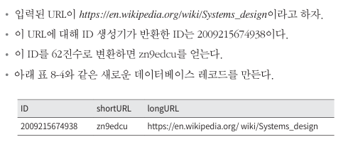
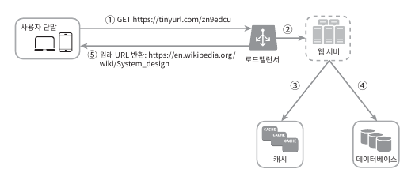

# 8. URL 단축기 설계
- 고전적인 시스템 설계 문제 중 하나, tiny url 같은 URL 단축기 설계 문제

## 8.1 문제 이해 및 설계 범위 확정
- 기본적 기능은 아래와 같음
  - URL 단축: 주어진 긴 URL을 훨씬 짧게 줄임
  - URL 리디렉션(redirection): 축약된 URL로 HTTP 요청이 오면 원래 URL로 안내
  - 높은 가용성과 규모 확장성, 그리고 장애 감내 요구
- 개략적 추정
  - 쓰기 연산: 매일 1억 개의 단축 URL 생성
  - 초당 쓰기 연산: 1억(100million)/24/3600=1160
  - 읽기 연산: 읽기 연산과 쓰기 연산 비율은 10:1이라고 하자. 읽기 연산은 초당 11,600회 발생
  - URL 단축 서비스를 10년간 운영한다고 가정하면 1억 x 365 x 10 = 3650억개의 레코드를 보관
  - 축약 전 URL의 평균 길이는 100이라고 하자
  - 10년 동안 필요한 저장 용량은 3650억 x 100byte = 36.5TB

## 8.2 개략적 설계안 제시 및 동의 구하기
- API 엔드포인트, URL 리디렉션, URL 단출 플로로 살펴봄

##### API 엔드포인트
- 클라이언트는 서버가 제공하는 API 엔드포인트를 통해 서버와 통신 -> REST 스타일로 설계
- URL 단축기는 기본적으로 2개의 엔드포인트를 필요
  - URL 단축용 엔드포인트: 새 단축 UR을 생성, 클라이언트에서 POST 요청
    - POST /api/v1/data/shorten
      - 인자: {longUrl: longURLstring}
      - 반환: 단축 URL
  - URL 리디렉션용 엔드포인트: 단축 URL에 대해서 HTTP 요청이 오면 원래 URL로 보내주기 위한 용도의 엔드포인트
    - GET /api/v1/shortUrl
      - 반환: HTTP 리디렉션 목적지가 될 원래 URL

##### URL 리디렉션

- 단축 URL을 받은 서버는 그 URL을 원래 URL로 바꾸어서 301 응답의 Location 헤더에 넣어서 반환\

- 유의할 것은 301 응답과 302 응답의 차이
  - 301 Permanently Moved
    - 해당 URL에 대한 HTTP 요청의 처리 책임이 영구적으로 Location 헤더에 반환된 URL로 이전
    - 영구적 이전이므로, 브라우저는 이 응답을 캐시 처리함 -> 추후 같은 요청에 브라우저에서 캐시된 원래 URL로 요청을 보냄
  - 302 Found
    - 일시적으로 Location 헤더가 지정하는 URL에 의해 처리되어야 하는 응답
    - 301과는 다르게 캐시처리되지 않고 언제나 같은 플로우로 작동
- 두 방법은 각기 다른 장단점 존재
  - 서버 부하를 줄이는 방향: 301 활용
  - 트래픽 분석이 중요: 302 활용 -> 클릭 발생률이나 발생 위치 추적 도움
- URL 리디렉션을 구현하는 가장 직관적인 방법은 해시 테이블 사용
  - 해시 테이블에 <단축 URL, 원래 URL>의 쌍을 저장
    - 원래 URL = hashTable.get(단축 URL)
    - 301 또는 302 응답 Location 헤더에 원래 URL을 넣은 후 전송

##### URL 단축

- 긴 URL을 해시 값으로 대응시킬 해시 함수 fx를 찾는 것은 중요한 일이므로 다음 요구 사항 만족
  - 입력으로 주어지는 긴 URL이 다른 값이면 해시 값도 달라야함
  - 계산된 해시 값은 원래 입력으로 주어졌던 긴 URL로 복원 가능

## 8.3 상세 설계
- 데이터 모델, 해시 함수, URL 단축 및 리디렉션 구체적인 설계안 살펴봄

##### 데이터 모델
- 모든 것을 해시 테이블로 설계 -> 메모리는 유한하기에 실제 시스템에 활용 곤란
- 더 나은 방법은 <단축 URL, 원래 URL>의 순서 쌍으로 RDB에 저장\

##### 해시 함수
- 원래 URL을 단축 URL로 변환하는데 사용, 편의상 단축 URL을 hashValue로 지칭
- 해시 값 길이
  - hashValue는 [0-9,a-z,A-Z]의 문자들로 구성 -> 사용 가능한 문자는 62개(10 + 26 +26)
  - hashValue의 길이를 정하기 위해서는 62의 n승 >= 3650억 인 n의 최솟값을 찾아야 함(3650억의 URL 생성)\

  - n이 7개면 3.5조 개의 URL을 만들수 있음 -> hashValue 길이는 7개로 함
- 해시 후 충돌 해소
  - CRC32, MD5, SHA-1 같이 잘 알려진 해시 함수를 이용하는 것이 손쉬운 방법임
  - https://en.wikipedia.org/wiki/Systems_design 을 해시 함수를 활용\

  - 제일 짧은 CRC32 조차도 7자리가 넘어가기에, 아래와 같은 방법을 활용\

  - 단축 URL을 만들때마다 한번 이상의 DB 조회 필요 -> 오버헤드 크기에 블룸 필터 활용
    - 블룸 필터: 집합 내 원소가 있는 것에 대한 확률을 통한 유무 값 반환
      - 집합 내 없는 값을 있다고 할 수 있어도, 있는 값을 없다고는 하지 않는 필터
- base-62변환
  - 진법 변환은 URL 단축기를 구현할 때 흔히 사용되는 접근법
  - 62진법을 쓰는 이유는 hashValue 문자 갯수가 62개이기에 활용
  - 활용법은 아래와 같음\

- 아래는 접근법의 차이를 비교함\

##### URL 단축기 상세 설계
- 처리 흐름이 논리적으로는 단순해야하며, 기능적으로 언제나 동작하는 상태 유지
- 여기 예제에서는 62진법 변환 기법을 사용해 설계할 것임\

- 5번에서 62진법 변환하여 적용, 아래는 예시\

- ID는 전역적 유일성 보장해야하며, 해당 부분은 7장에서 설명함

##### URL 리디렉션 상세 설계

## 8.4 마무리
- 시간이 남으면 아래와 같은 사항 논의
  - 처리율 제한 장치: 불필요한 요청으로 인한 잠재적 보안 결함 해소
  - 웹 서버의 규모 확장: 무상태 계층이므로 웹서버 자유로이 증설
  - 데이터베이스의 규모 확장: 다중화나 샤딩을 하여 규모 확장성 달성
  - 데이터 분석 솔루션: 비즈니스를 위해 데이터 분석 -> 어떤 링크에 얼마나 많은 이용자가 활용 등
  - 가용성, 데이터 일관성, 안전성