# 9. 웹 크롤러 설계
- 크롤러는 다양하게 이용
  - 검색 엔진 인덱싱
    - 웹 페이지를 모아 검색 엔진을 위한 로컬 인덱스 생성
    - Googlebot의 구글 검색 엔진이 사용
  - 웹 아카이빙
    - 나중에 사용할 목적으로 장기보관하기 위해 웹에서 정보 수집(웹 사이트를 아카이빙)
    - 미국 국회 도서관
  - 웹 마이닝
    - 웹 마이닝을 통해 인터넷에서 유용한 지식 도출
    - 유명 금융 기업들은 총회 자료나 연차보고서를 다운 받아 기업의 핵심 사업 방향 도출
  - 웹 모니터링
    - 인터넷에서 저작권이나 상표권이 침해되는 사례 모니터링
    - 디지마크사는 해적판 저작물을 찾아내서 보고함
- 규모에 따라 작은 학급 프로젝트에서 초대형 프로젝트까지 다양함

## 9.1 문제 이해 및 설계 범위 확정
- 웹 크롤러 기본 알고리즘은 간단하지만 엄청난 규모확장성을 갖는 크롤러를 설계하는건 엄청나게 어려운 작업임
- 좋은 웹 크롤러가 만족시켜야할 아래와 같은 속성 존재
  - 규모 확장성
    - 웹은 거대하기에, 병렬성을 활용하면 보다 효과적으로 웹 크롤링을 할 수 있을 것
  - 안전성
    - 웹은 반응성 없는 서버, 악성 코드 등 비정상적 입력이나 환경에 잘 대응할 수 있어야함
  - 예절
    - 수집 대상 웹 사이트에 짧은 시간동안 너무 많은 요청을 보내서는 안됨
  - 확장성
    - 새로운 형태의 콘텐츠를 지원하기 쉬워야 함 -> 이미지 파일도 크롤링 하고 싶다는 요구사항 수용 가능

##### 개략적 규모 추정
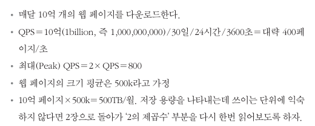\

## 9.2 개략적 설계안 제시 및 동의 구하기
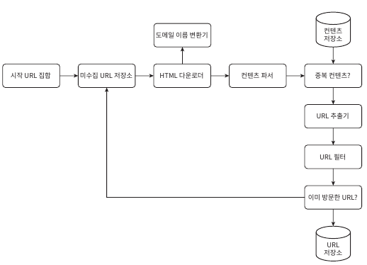

##### 시작 URL 집합
- 웹 크롤링을 시작하는 출발점
- 가장 직관적인 방법은 도메인 이름이 붙은 모든 페이지의 URL을 시작 URL로 사용
- 크롤러가 가능한 많은 링크를 탐색할 수 있도록 하는 URL을 고르는 것이 바람직함
- 시작 URL로 무엇을 쓸 것이냐는 질문에 정답은 없음

##### 미수집 URL 저장소
- 웹 크롤러의 크롤링 상태
  - 다운로드할 URL
  - 다운로드된 URL
- '다운로드할 URL'을 저장 관리하는 컴포넌트를 미수집 URL 저장소라 함
- FIFO 큐라고 생각하면 됨

##### HTML 다운로더
- 인터넷에서 웹 페이지를 다운로드하는 컴포넌트

##### 도메인 이름 변환기
- URL을 IP주소로 변환하는 컴포넌트

##### 컨텐츠 파서
- 웹 페이지를 다운도르하면 파싱과 검증 하는 컴포넌트
  - 이상한 웹 페이지 인지 확인

##### 중복컨텐츠인가?
- 같은 컨텐츠를 여러번 저장하는 것을 방지하는 컴포넌트

##### 콘텐츠 저장소
- HTML 문서를 보관하는 시스템
- 저장할 데이터의 유형, 크기, 저장소 접근 빈호 등 종합적으로 고려 필요
  - 데이터 양이 너무 많으므로 디스크에 저장
  - 인기 있는 컨텐츠는 메모리에 두어 접근 지연시간 감소

##### URL 추출기
- HTML 페이지 내 파싱하여 링크들을 골라내는 역할
- 상대 경로를 전부 절대 경로로 변환

##### URL 필터
- 특정 콘텐츠 타입이나 파일 확장자를 갖는 URL, 접속 시 오류가 발생하는 URL 등을 크롤링 대상에서 배제

##### 이미 방문한 URL?
- 이미 방문한 URL인지 확인하는 컴포넌트 
- 블룸 필터나 해시 테이블 활용

##### URL 저장소
- 이미 방문한 URL을 보관하는 저장소

##### 웹 크롤러 작업 흐름
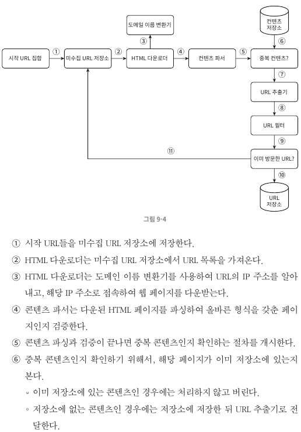\
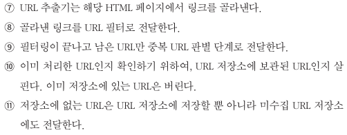

## 9.3 상세 설계
- 가장 중요한 컴포넌트와 그 구현 기술
  - DFS(Depth-First Search) vs BFS(Breath-First Search)
  - 미수집 URL 저장소
  - HTML 다운로더
  - 안정성 확보 전략
  - 확장성 확보 전략
  - 문제 있는 컨텐츠 감지 및 회피 전략

##### DFS를 쓸것인가, BFS를 쓸것인가
- 웹은 유향 그래프와 같기에, 크롤링 프로세스는 그래프를 에지에 따라 탐색
  - 페이지는 노드
  - 하이퍼 링크는 에지
- DFS보단 BFS를 선호
  - 그래프 크기가 클 경우 어느 정도로 깊숙이 가게 될지 가늠이 어려움
- BFS는 FIFO 큐를 사용하는 알고리즘이며, 한쪽으로는 탐색할 URL 다른 한쪽으로 꺼냄
- 하지만 구현법에는 2가지 문제점 존재
  - 한 페이지에서 나오는 링크의 상당수는 같은 서버로 돌아감 -> 병렬 요청 시, 같은 서버에게 수많은 부하 발생
  - 표준 BFS 알고리즘은 URL 간 우선순위를 두지 않고 모두 공평하게 대우 -> 웹 페이지 전체가 같은 품질을 가지지 않기에 우선순위 구별 필요

##### 미수집 URL 저장소
- 저장소를 잘 구현하면 '예의'를 갖춘 크롤러, 우선순위와 신선도를 구별하는 크롤러 구현 가능'
- 예의
  - 동일 웹 사이트에 대해서는 한 번에 한 페이지만 요청
  - 같은 웹 사이트에 페이지를 다운 테스크에 시간차를 두고 실행
  - 호스트 명과 작업 스레드를 1:1로 관계 매핑
  - 큐에서 꺼낸 URL만 다운로드\
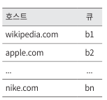\
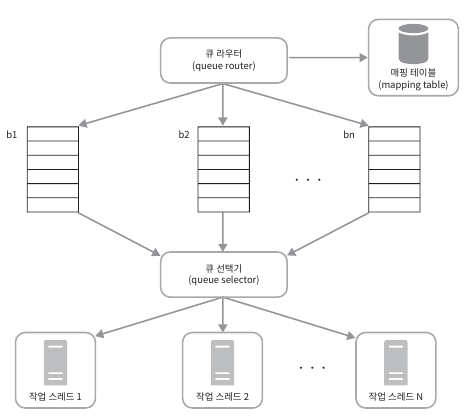
- 우선순위
  - 유용성에 따라 URL 우선 순위 나눌때 여러가지 척도 있음
    - 페이지 랭크
    - 트래픽
    - 갱신 빈도
  - 아래 설명할 순위결정장치는 URL 우선순위를 정하는 컴포넌트\
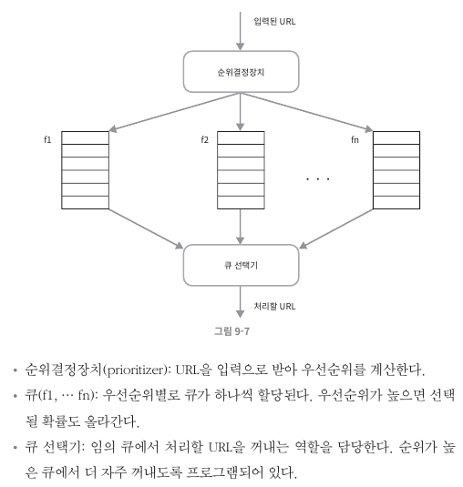
  - 아래는 이를 반영한 전체 설계\
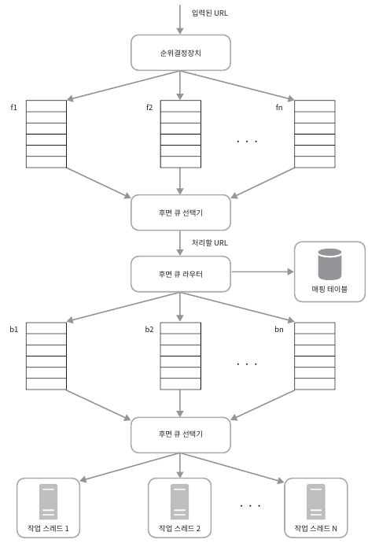
    - 전면 큐: 우선순위 결정 과정을 처리
    - 후면 큐: 크롤러가 예의 바르게 동작 보증
- 신선도
  - 웹 페이지는 수시로 추가, 삭제, 변경됨
  - 신선도를 위해선 이미 다운로드 한 페이지라도 재수집해야함
  - 모든 URL 재수집은 많은 리소스가 들기에 최적화 전략이 존재
    - 웹 페이지의 변경 이력 활용
    - 우선순위를 활용하여 중요한 페이지는 좀더 자주 재수집
- 미수집 URL 저장소를 위한 지속성 저장장치
  - 처리해야하는 URL의 수는 수억개 달함 -> 데이터를 메모리 보관하는건 바람직 하지 않음
  - 그렇다고 전부 디스크 저장은 병목현상 야기시킴
  - 절충안
    - 대부분의 URL은 디스크에 두지만 IO 비용을 줄이기 위해 메모리 버퍼 큐를 두는 것
      (?) 이부분 잘 이해가... 

##### HTML 다운로더
- HTTP 프로토콜을 통해 웹 페이지를 내려 받음
- 로봇 제외 프로토콜(Robot.txt)
  - 크롤러가 수집해도 되는 페이지 목록 존재\
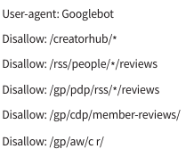
- 성능 최적화
  - 분산 크롤링
    - 성능을 높이기 위해 크롤링 작업을 여러 서버에 분산\
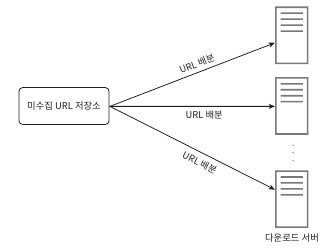
  - 도메인 이름 변환 결과 캐시
    - DNS resolver는 크롤러 성능의 병목 -> 동기적 특성
    - 캐시 보관 및 크론 잡을 통해 자주 갱신
  - 지역성
    - 크롤링 수행 서버를 지역별로 분산 -> 페이지 다운로드 시간 감소
  - 짧은 타임아웃
    - 어떤 웹서버는 응답이 느리거나 아예 응답하지 않기에 대기시간을 짧게 처리

##### 안전성
- 시스템 안전성을 향상시키기 위한 접근법
  - 안정 해시
    - 다운로더 서버들에 부하를 분산 적용
  - 크롤링 상태 및 수집 데이터 저장
    - 장애가 발생하여도 쉽게 복구할 수 있게 크롤링 상태와 수집된 데이터 지속적 저장장치 기록
  - 예외 처리
    - 예외가 발생해도 전체 시스템이 중단되는 일 없이 이어나갈 수 있어야 함
  - 데이터 검증
    - 시스템 오류를 방지하기 위한 중요 수단 가운데 하나

##### 확장성
- 시스템 설계할 때, 새로운 형태의 콘텐츠를 쉽게 지원 할수 있도록 신경 써야함
- 새로운 모듈을 끼워 넣음으로 새로운 형태 콘텐츠 지원\
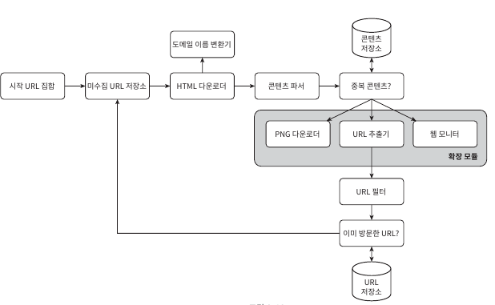

##### 문제 있는 컨텐츠 감지 및 회피
- 중복, 의미 없거나 유해한 컨텐츠 감지 방법
  - 중복 콘텐츠
    - 해시나 체크섬을 사용
  - 거미 덫
    - 크롤러를 무한 루프에 빠뜨리도록 설계한 웹 페이지\
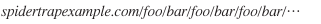
    - URL의 최대 길이를 제한하면 회피 가능
    - 하지만 만능 해결책은 없기에 사람이 수작업으로 덫 확인 필요 -> 확인 후 제외 대상 포함
  - 데이터 노이즈
    - 광고나, 스팸 URL은 컨텐츠적 가치가 없기에 제외

## 9.4 마무리
- 좋은 크롤러 갖추어야하는 특성
  - 규모 확장성
  - 예의
  - 확장성(지원 컨텐츠 확장 등)
  - 안전성
- 시간 허락하면 아래와 같은 주제 논의
  - 서버측 렌더링
    - CSR과 같은 페이지는 기술을 사용하여 링크를 즉석으로 만들어 냄 -> 실제 받으면 빈 페이지
    - 파싱 전에 서버 측 렌더링을 적용하자
  - 원치 않은 페이지 필터링
    - 스팸 방지 컴포넌트를 두어 품질이 조악하거나 스팸 성인페이지 제외
  - 데이터베이스 다중화 및 샤딩
    - 다중화 및 샤딩을 통해 데이터 계층의 가용성, 확장성 및 안전성 확보
  - 수평적 규모 확장성
    - 서버의 규모 확장을 위해 무상태 서버로 만들기
  - 가용성, 일관성, 안전성
  - 데이터 분석 솔루션
  